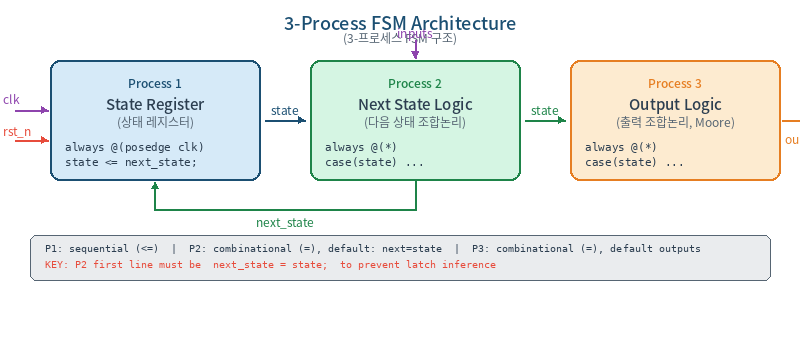
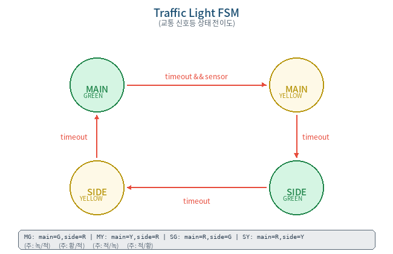
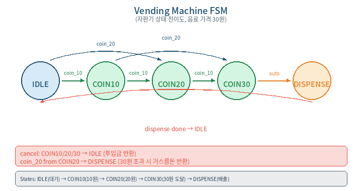
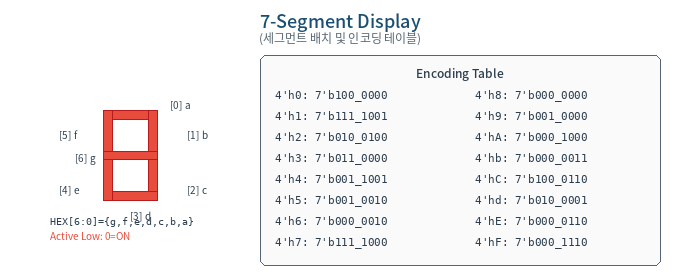
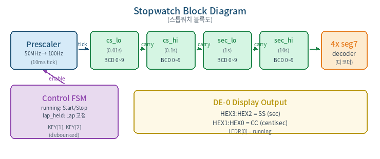
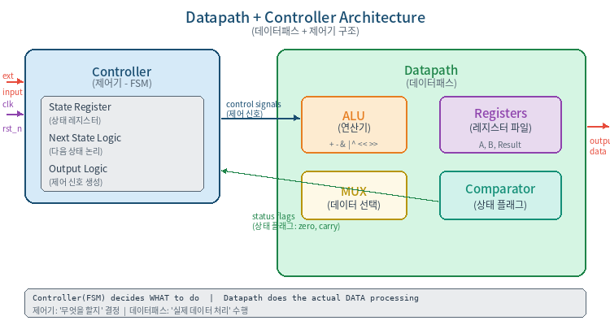
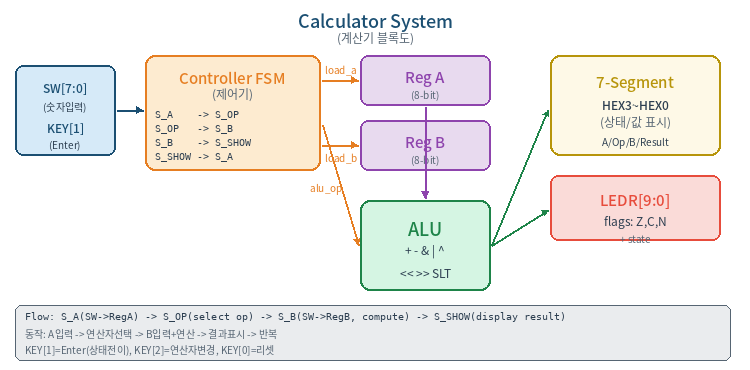
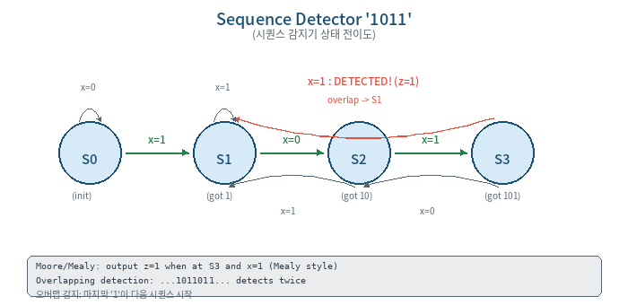

### Verilog 응용 설계 및 AI 활용 코딩

4~7주차 상세 강의 자료
FSM 응용 · 7-Segment · 데이터패스 · 종합 설계
2026학년도 1학기


---

# 4주차: FSM 설계 기초


## 4-1. [월] FSM 이론 (70분)


### 학습 목표

Moore/Mealy 머신의 차이를 설명할 수 있다
3-Process FSM 코딩 스타일로 FSM을 설계할 수 있다
버튼 디바운스 회로를 FSM으로 구현할 수 있다
1. Moore vs Mealy 머신
Moore 머신: 출력이 현재 상태에만 의존. 출력이 안정적이나 입력 반영에 1 클럭 지연.
Mealy 머신: 출력이 현재 상태 + 입력에 의존. 반응이 빠르지만 입력 글리치가 출력에 전파될 수 있음.

> 💡 **TIP:**  강의에서는 출력 안정성을 위해 Moore 방식 + 3-Process 스타일을 권장한다.

2. 3-Process FSM 아키텍처

3-Process 스타일의 장점: 상태 레지스터, 전이 논리, 출력 논리가 분리되어 가독성과 디버깅이 용이하다.



3. 3-Process FSM 코딩 템플릿
```verilog
module fsm_template(
    input      clk, rst_n,
    input      go, done_sig,
    output reg busy, complete
);
    // (1) 상태 정의 — localparam 사용
    localparam IDLE    = 2'b00,
               RUNNING = 2'b01,
               FINISH  = 2'b10;
    reg [1:0] state, next_state;

    // Process 1: 상태 레지스터 (순차논리)
    always @(posedge clk or negedge rst_n) begin
        if (!rst_n) state <= IDLE;
        else        state <= next_state;
    end

    // Process 2: 다음 상태 논리 (조합논리)
    always @(*) begin
        next_state = state;          // ★ 기본값 (래치 방지)
        case (state)
            IDLE:    if (go)       next_state = RUNNING;
            RUNNING: if (done_sig) next_state = FINISH;
            FINISH:                next_state = IDLE;
            default:               next_state = IDLE;
        endcase
    end

    // Process 3: 출력 논리 (조합논리, Moore)
    always @(*) begin
        busy     = 1'b0;            // ★ 기본값
        complete = 1'b0;
        case (state)
            RUNNING: busy     = 1'b1;
            FINISH:  complete = 1'b1;
            default: ;
        endcase
    end
endmodule
```


> ⚠️ **WARNING:** Process 2에서 next_state = state; 기본값을 빠뜨리면 래치가 생긴다! 반드시 항상 첫 줄에 기본값을 할당하라.

4. 교통 신호등 FSM 예제




```verilog
module traffic_light(
    input        clk, rst_n,   // 50MHz, KEY[0]
    input        sensor,       // SW[0]: 차량 감지
    output reg [2:0] light_main,  // LEDR[2:0]: {R,Y,G}
    output reg [2:0] light_side   // LEDR[5:3]: {R,Y,G}
);
    localparam MAIN_GREEN  = 2'd0, MAIN_YELLOW = 2'd1,
               SIDE_GREEN  = 2'd2, SIDE_YELLOW = 2'd3;
    localparam GREEN_T  = 26'd49_999_999,  // 1초 (데모)
               YELLOW_T = 26'd24_999_999;  // 0.5초

    reg [1:0]  state, next_state;
    reg [25:0] timer;
    wire       timeout = (timer == 0);

    // 타이머
    always @(posedge clk or negedge rst_n)
        if (!rst_n) timer <= GREEN_T;
        else if (state != next_state)
            timer <= (next_state==MAIN_YELLOW||next_state==SIDE_YELLOW)
                     ? YELLOW_T : GREEN_T;
        else if (timer > 0) timer <= timer - 1;

    // P1: 상태 레지스터
    always @(posedge clk or negedge rst_n)
        if (!rst_n) state <= MAIN_GREEN;
        else        state <= next_state;

    // P2: 다음 상태
    always @(*) begin
        next_state = state;
        case (state)
            MAIN_GREEN:  if (timeout && sensor) next_state = MAIN_YELLOW;
            MAIN_YELLOW: if (timeout)           next_state = SIDE_GREEN;
            SIDE_GREEN:  if (timeout)           next_state = SIDE_YELLOW;
            SIDE_YELLOW: if (timeout)           next_state = MAIN_GREEN;
            default:                            next_state = MAIN_GREEN;
        endcase
    end

    // P3: 출력 {R,Y,G}
    always @(*) begin
        light_main = 3'b100; light_side = 3'b100; // 기본: 양쪽 적색
        case (state)
            MAIN_GREEN:  begin light_main=3'b001; light_side=3'b100; end
            MAIN_YELLOW: begin light_main=3'b010; light_side=3'b100; end
            SIDE_GREEN:  begin light_main=3'b100; light_side=3'b001; end
            SIDE_YELLOW: begin light_main=3'b100; light_side=3'b010; end
        endcase
    end
endmodule
```


## 4-2. [수] 실습: FSM 코딩 (70분)

실습 1: 버튼 디바운스 FSM
기계식 버튼은 누를 때 수 ms 동안 접점이 떨리며(bouncing) 여러 번의 에지가 발생한다. FSM으로 20ms 안정 시간을 확보하는 디바운서를 설계한다.
```verilog
module btn_debounce(
    input      clk,       // 50MHz
    input      btn_raw,   // 원시 버튼 (active low)
    output reg btn_pulse  // 디바운스된 1-clk 펄스
);
    localparam IDLE=2'd0, WAIT_P=2'd1, PRESSED=2'd2, WAIT_R=2'd3;
    localparam DEBOUNCE_CNT = 20'd999_999; // 20ms @ 50MHz

    reg [1:0]  state, next_state;
    reg [19:0] cnt;
    wire       cnt_done = (cnt == DEBOUNCE_CNT);

    // 카운터: 상태 전이 시 리셋
    always @(posedge clk)
        if (state != next_state) cnt <= 0;
        else if (!cnt_done)      cnt <= cnt + 1;

    // P1
    always @(posedge clk)
        state <= next_state;

    // P2
    always @(*) begin
        next_state = state;
        case (state)
            IDLE:    if (!btn_raw)            next_state = WAIT_P;
            WAIT_P:  if (btn_raw)             next_state = IDLE;
                     else if (cnt_done)       next_state = PRESSED;
            PRESSED:                          next_state = WAIT_R;
            WAIT_R:  if (btn_raw && cnt_done) next_state = IDLE;
                     else if (!btn_raw)       ; // 계속 대기
            default:                          next_state = IDLE;
        endcase
    end

    // P3: PRESSED에서 1-clk 펄스
    always @(posedge clk)
        btn_pulse <= (state == PRESSED);
endmodule
```

실습 2: 교통 신호등 보드 테스트 (DE-0/DE1)
위의 traffic_light 모듈을 보드에 구현한다. 디바운스된 KEY[2]로 sensor 토글.
LEDR[2:0] = 주도로 {R,Y,G}, LEDR[5:3] = 보조도로 {R,Y,G}
HEX0에 현재 상태 번호(0~3), HEX1에 타이머 남은 시간(초) 표시
4주차 과제

### 과제 4-1 (필수): 자판기 FSM





상태: IDLE → COIN_10 → COIN_20 → COIN_30 → DISPENSE
입력: coin_10, coin_20, cancel (KEY 사용, 디바운스 적용)
출력: dispense, change[4:0] (거스름돈), 현재 투입금을 HEX에 표시
3-Process FSM + Self-Checking TB + 보드 시연


---

# 5주차: FSM 응용 및 7-Segment 제어


## 5-1. [월] 7-Segment 디코더 및 스톱워치 (70분)


### 학습 목표

7-Segment 디스플레이의 세그먼트 매핑을 이해한다
BCD 카운터 체인을 설계하여 시간 표시에 활용할 수 있다
Prescaler를 이용하여 50MHz를 원하는 주파수로 분주할 수 있다
1. 7-Segment 디스플레이 구조




> 📝 **NOTE:**  보드 모두 7-seg는 Active Low: 세그먼트를 켜려면 0, 끄려면 1을 출력한다.

2. 스톱워치 시스템 구조




3. Prescaler 설계
```verilog
// 50MHz → 100Hz Prescaler (10ms tick)
module prescaler_100hz(
    input      clk, rst_n, enable,
    output reg tick
);
    localparam MAX = 26'd499_999; // 50M/100 - 1
    reg [25:0] cnt;

    always @(posedge clk or negedge rst_n) begin
        if (!rst_n)       begin cnt <= 0; tick <= 0; end
        else if (!enable) begin cnt <= 0; tick <= 0; end
        else if (cnt == MAX) begin cnt <= 0; tick <= 1; end
        else              begin cnt <= cnt + 1; tick <= 0; end
    end
endmodule
```

4. BCD 카운터
```verilog
// 1자리 BCD 카운터 (0~9, carry 출력)
module bcd_digit(
    input      clk, rst_n, tick_in,
    output reg [3:0] digit,
    output     carry
);
    assign carry = (digit == 4'd9) && tick_in;

    always @(posedge clk or negedge rst_n) begin
        if (!rst_n)          digit <= 4'd0;
        else if (tick_in)
            digit <= (digit == 4'd9) ? 4'd0 : digit + 4'd1;
    end
endmodule
```

5. 스톱워치 전체 코드
```verilog
module stopwatch(
    input        CLOCK_50, 
    input  [3:0] KEY,        // KEY[0]=rst, KEY[1]=start/stop, KEY[2]=lap
    output [6:0] HEX0, HEX1, HEX2, HEX3,
    output [9:0] LEDR
);
    wire rst_n = KEY[0];
    wire btn_ss, btn_lap;
    btn_debounce db1(.clk(CLOCK_50),.btn_raw(KEY[1]),.btn_pulse(btn_ss));
    btn_debounce db2(.clk(CLOCK_50),.btn_raw(KEY[2]),.btn_pulse(btn_lap));

    // Start/Stop 토글
    reg running;
    always @(posedge CLOCK_50 or negedge rst_n)
        if (!rst_n) running <= 0;
        else if (btn_ss) running <= ~running;

    // Prescaler: 50MHz → 100Hz
    wire tick_100hz;
    prescaler_100hz u_pre(.clk(CLOCK_50),.rst_n(rst_n),
                          .enable(running),.tick(tick_100hz));

    // BCD 카운터 체인: cs_lo.cs_hi.sec_lo.sec_hi
    wire [3:0] cs_lo, cs_hi, sec_lo, sec_hi;
    wire c0, c1, c2;
    bcd_digit d0(.clk(CLOCK_50),.rst_n(rst_n),.tick_in(tick_100hz),
                 .digit(cs_lo),.carry(c0));
    bcd_digit d1(.clk(CLOCK_50),.rst_n(rst_n),.tick_in(c0),
                 .digit(cs_hi),.carry(c1));
    bcd_digit d2(.clk(CLOCK_50),.rst_n(rst_n),.tick_in(c1),
                 .digit(sec_lo),.carry(c2));
    bcd_digit d3(.clk(CLOCK_50),.rst_n(rst_n),.tick_in(c2),
                 .digit(sec_hi)); // sec_hi: 0~5

    // Lap 기능
    reg lap_held;
    reg [3:0] d_h3,d_h2,d_h1,d_h0;
    always @(posedge CLOCK_50 or negedge rst_n)
        if (!rst_n) lap_held <= 0;
        else if (btn_lap) lap_held <= ~lap_held;

    always @(posedge CLOCK_50)
        if (!lap_held) {d_h3,d_h2,d_h1,d_h0} <= {sec_hi,sec_lo,cs_hi,cs_lo};

    seg7_decoder h0(.hex(d_h0),.seg(HEX0));
    seg7_decoder h1(.hex(d_h1),.seg(HEX1));
    seg7_decoder h2(.hex(d_h2),.seg(HEX2));
    seg7_decoder h3(.hex(d_h3),.seg(HEX3));
    assign LEDR[0] = running;
    assign LEDR[9:1] = 9'b0;
endmodule
```


## 5-2. [수] 실습: 스톱워치 보드 구현 (70분)


### 실습 순서

btn_debounce, prescaler_100hz, bcd_digit, seg7_decoder를 각각 코딩
각 모듈의 Testbench 작성 및 단위 검증
stopwatch Top Module 작성 및 통합 시뮬레이션
보드에 다운로드하여 동작 확인

> 💡 **TIP:** 뮬레이션에서는 prescaler MAX 값을 4 정도로 줄여 빠르게 테스트하고, 보드용은 원래 값으로 복원하라.

5주차 과제

### 과제 5-1 (필수): 디지털 시계 (MM:SS)

HEX3:HEX2 = 분(00~59), HEX1:HEX0 = 초(00~59)
KEY[1]로 분 수동 증가, KEY[2]로 설정/실행 모드 전환
설정 모드: 해당 자리 0.5초 주기 점멸 (표시/소등 반복)
TB + 보드 시연
과제 5-2 (가산점): 스톱워치에 Split 기능 추가 (최근 3개 랩 타임을 메모리에 저장, KEY[3]으로 순환 표시)


---

# 6주차: 데이터패스 + 제어기 설계


## 6-1. [월] 설계 방법론 (70분)


### 학습 목표

데이터패스/제어기 분리 설계 방법론을 설명할 수 있다
ALU를 설계하고 데이터패스에 통합할 수 있다
계산기를 FSM 제어기 + 데이터패스로 구현할 수 있다
1. 데이터패스/제어기 분리 설계




복잡한 디지털 시스템은 두 부분으로 분리한다:
제어기 (Controller): FSM으로 구현. '무엇을 할지'(언제 어떤 레지스터를 로드하고, 어떤 연산을 수행할지) 결정.
데이터패스 (Datapath): 레지스터, ALU, MUX 등으로 구성. 제어기의 명령에 따라 '실제 데이터를 처리'.

> 💡 **TIP:**  분리가 6주차의 핵심 개념이다. 이후 프로젝트와 AI 코딩에서도 이 구조를 기준으로 설계한다.

2. 8-bit ALU 설계
```verilog
module alu_8bit(
    input  [7:0] a, b,
    input  [2:0] op,
    output reg [7:0] result,
    output       zero, carry_out, negative
);
    reg [8:0] temp;
    always @(*) begin
        temp = 9'b0;
        case(op)
            3'b000: temp = a + b;          // ADD
            3'b001: temp = a - b;          // SUB
            3'b010: temp = {1'b0, a & b};  // AND
            3'b011: temp = {1'b0, a | b};  // OR
            3'b100: temp = {1'b0, a ^ b};  // XOR
            3'b101: temp = {1'b0, a << 1}; // SHL
            3'b110: temp = {1'b0, a >> 1}; // SHR
            3'b111: temp = (a < b) ? 9'd1 : 9'd0; // SLT
            default: temp = 9'b0;
        endcase
        result = temp[7:0];
    end
    assign carry_out = temp[8];
    assign zero      = (result == 8'b0);
    assign negative  = result[7];
endmodule
```

3. 계산기 시스템




```verilog
module calculator(
    input        CLOCK_50,
    input  [9:0] SW,
    input  [3:0] KEY,
    output [6:0] HEX0, HEX1, HEX2, HEX3,
    output [9:0] LEDR
);
    wire rst_n = KEY[0];
    wire btn_enter, btn_op;
    btn_debounce db_e(.clk(CLOCK_50),.btn_raw(KEY[1]),.btn_pulse(btn_enter));
    btn_debounce db_o(.clk(CLOCK_50),.btn_raw(KEY[2]),.btn_pulse(btn_op));

    // --- 데이터패스 ---
    reg [7:0] reg_a, reg_b, reg_result;
    reg [2:0] alu_op;
    wire [7:0] alu_out;
    wire alu_zero, alu_carry, alu_neg;

    alu_8bit u_alu(.a(reg_a),.b(reg_b),.op(alu_op),
                   .result(alu_out),.zero(alu_zero),
                   .carry_out(alu_carry),.negative(alu_neg));

    // --- 제어기 FSM ---
    localparam S_A=2'd0, S_OP=2'd1, S_B=2'd2, S_SHOW=2'd3;
    reg [1:0] state, next_state;

    always @(posedge CLOCK_50 or negedge rst_n)
        if (!rst_n) state <= S_A;
        else        state <= next_state;

    always @(*) begin
        next_state = state;
        case(state)
            S_A:    if (btn_enter) next_state = S_OP;
            S_OP:   if (btn_enter) next_state = S_B;
            S_B:    if (btn_enter) next_state = S_SHOW;
            S_SHOW: if (btn_enter) next_state = S_A;
        endcase
    end

    // 데이터 경로 제어
    always @(posedge CLOCK_50 or negedge rst_n) begin
        if (!rst_n) begin
            reg_a<=0; reg_b<=0; alu_op<=0; reg_result<=0;
        end else case(state)
            S_A:  if (btn_enter) reg_a <= SW[7:0];
            S_OP: begin
                if (btn_op) alu_op <= alu_op + 1;
            end
            S_B:  if (btn_enter) begin
                reg_b <= SW[7:0];
                reg_result <= alu_out;
            end
            S_SHOW: ;
        endcase
    end

    // 디스플레이 (상태별 표시 내용 변경)
    reg [3:0] dh3,dh2,dh1,dh0;
    always @(*) begin
        case(state)
            S_A:    begin dh3=4'hA;       dh2=4'h0;
                          dh1=SW[7:4];    dh0=SW[3:0]; end
            S_OP:   begin dh3=4'h0;       dh2=alu_op[2:0];
                          dh1=reg_a[7:4]; dh0=reg_a[3:0]; end
            S_B:    begin dh3=4'hB;       dh2=4'h0;
                          dh1=SW[7:4];    dh0=SW[3:0]; end
            S_SHOW: begin dh3=4'hE;       dh2=4'h0;
                          dh1=reg_result[7:4]; dh0=reg_result[3:0]; end
            default:begin dh3=0;dh2=0;dh1=0;dh0=0; end
        endcase
    end
    seg7_decoder sh3(.hex(dh3),.seg(HEX3));
    seg7_decoder sh2(.hex(dh2),.seg(HEX2));
    seg7_decoder sh1(.hex(dh1),.seg(HEX1));
    seg7_decoder sh0(.hex(dh0),.seg(HEX0));

    assign LEDR = {alu_neg, alu_carry, alu_zero, 5'b0, state};
endmodule
```


## 6-2. [수] 실습: 계산기 구현 (70분)


### 실습 순서

ALU 모듈 코딩 → TB로 8개 연산 전수 검증
Calculator Top 작성 → FSM 동작 시뮬레이션
보드에서 실제 계산 시연
6주차 과제

### 과제 6-1 (필수): 계산기 완성 및 확장

연산자를 HEX3에 문자로 표시: A(Add), 5(Sub), n(aNd), o(Or), etc.
연산 결과를 10진수로 HEX에 표시 (hex2bcd 변환기 설계 필요)
음수 결과 시 '-' 표시 + 절대값
과제 6-2 (가산점): 연산 이력 기능 — 최근 4개 연산 결과를 메모리에 저장하고 KEY[3]으로 순환 표시


---

# 7주차: 종합 설계 연습 및 중간고사 대비


## 7-1. [월] 종합 설계 예제 (70분)


### 학습 목표

지금까지 배운 모든 기법을 조합하여 시스템을 설계할 수 있다
LFSR을 이용한 의사 난수 생성을 이해한다
시퀀스 감지기 FSM을 설계할 수 있다
1. LFSR (Linear Feedback Shift Register)
LFSR은 하드웨어에서 의사 난수를 생성하는 가장 효율적인 방법이다.
```verilog
// 16-bit LFSR (다항식: x^16 + x^14 + x^13 + x^11 + 1)
module lfsr_16(
    input            clk, rst_n, enable,
    input     [15:0] seed,
    input            load,
    output reg [15:0] lfsr_out
);
    wire feedback = lfsr_out[15] ^ lfsr_out[13] 
                  ^ lfsr_out[12] ^ lfsr_out[10];

    always @(posedge clk or negedge rst_n) begin
        if (!rst_n)       lfsr_out <= 16'hACE1; // 기본 시드
        else if (load)    lfsr_out <= seed;
        else if (enable)  lfsr_out <= {lfsr_out[14:0], feedback};
    end
endmodule
```


> 📝 **NOTE:** FSR 시드값이 0이면 영원히 0으로 남는다! 리셋 값은 반드시 0이 아닌 값으로 설정하라.

2. 시퀀스 감지기 ('1011' Detector)




```verilog
module seq_detector_1011(
    input      clk, rst_n,
    input      x,         // 시리얼 입력
    output reg detected   // 1011 감지 시 1-clk 펄스
);
    localparam S0=3'd0, S1=3'd1, S2=3'd2, S3=3'd3;
    reg [2:0] state, next_state;

    // P1
    always @(posedge clk or negedge rst_n)
        if (!rst_n) state <= S0;
        else        state <= next_state;

    // P2
    always @(*) begin
        next_state = S0;
        case (state)
            S0: next_state = x ? S1 : S0;  // 첫 '1'
            S1: next_state = x ? S1 : S2;  // '10'
            S2: next_state = x ? S3 : S0;  // '101'
            S3: next_state = x ? S1 : S2;  // '1011'→감지, 오버랩
            default: next_state = S0;
        endcase
    end

    // P3: S3에서 x=1이면 감지 (Mealy 출력)
    always @(posedge clk or negedge rst_n)
        if (!rst_n) detected <= 0;
        else        detected <= (state == S3) && x;
endmodule
```


> 💡 **TIP:** 버랩 감지: '10110' 시퀀스에서 '1011'을 감지한 후, 마지막 '1'이 다음 시퀀스의 시작이 된다 (S3→S1).

3. 반응속도 측정기 (종합 설계)
LFSR(난수) + FSM(제어) + Prescaler(타이머) + 7-seg(표시)를 조합한 시스템:
```verilog
module reaction_timer(
    input        CLOCK_50,
    input  [3:0] KEY,     // KEY[0]=rst, KEY[1]=start, KEY[2]=react
    output [6:0] HEX0, HEX1, HEX2, HEX3,
    output [9:0] LEDR
);
    localparam IDLE=3'd0, WAIT_RND=3'd1, LED_ON=3'd2,
               MEASURE=3'd3, RESULT=3'd4, TOO_EARLY=3'd5;

    wire rst_n=KEY[0], btn_start, btn_react;
    btn_debounce ds(.clk(CLOCK_50),.btn_raw(KEY[1]),.btn_pulse(btn_start));
    btn_debounce dr(.clk(CLOCK_50),.btn_raw(KEY[2]),.btn_pulse(btn_react));

    reg [2:0] state, next_state;
    wire [15:0] rnd;
    lfsr_16 u_lfsr(.clk(CLOCK_50),.rst_n(rst_n),
                   .enable(1'b1),.load(1'b0),.seed(16'h0),.lfsr_out(rnd));

    // 1ms prescaler
    reg [15:0] ms_pre;
    wire ms_tick = (ms_pre == 16'd49_999);
    always @(posedge CLOCK_50 or negedge rst_n)
        if (!rst_n) ms_pre <= 0;
        else ms_pre <= ms_tick ? 0 : ms_pre + 1;

    // 랜덤 대기 카운터 & 측정 카운터 (학생이 완성)
    reg [15:0] wait_cnt, reaction_ms;
    wire [9:0] wait_target = rnd[9:0] + 10'd500; // 500~1523ms
    // ... (상태 머신 및 카운터 로직 — 학생 구현 과제)

    // P1
    always @(posedge CLOCK_50 or negedge rst_n)
        if (!rst_n) state <= IDLE;
        else        state <= next_state;

    // P2: 학생이 완성
    always @(*) begin
        next_state = state;
        case(state)
            IDLE:      if (btn_start)                next_state = WAIT_RND;
            WAIT_RND:  if (btn_react)                next_state = TOO_EARLY;
                       else if (wait_cnt>=wait_target) next_state = LED_ON;
            LED_ON:                                  next_state = MEASURE;
            MEASURE:   if (btn_react)                next_state = RESULT;
            RESULT:    if (btn_start)                next_state = IDLE;
            TOO_EARLY: if (btn_start)                next_state = IDLE;
            default:                                 next_state = IDLE;
        endcase
    end

    assign LEDR[0] = (state == LED_ON) || (state == MEASURE);
    assign LEDR[9] = (state == TOO_EARLY);
    // HEX 표시: RESULT 상태에서 reaction_ms를 BCD로 변환하여 표시
endmodule
```


## 7-2. [수] 중간고사 리뷰 (70분)


### 중간고사 범위 정리

Verilog 문법: module, wire/reg, assign, always, blocking/non-blocking
조합논리: MUX, decoder, encoder, ALU, barrel shifter
순차논리: 레지스터, 카운터, 시프트 레지스터, prescaler
FSM: Moore/Mealy, 3-process, 상태 인코딩, 디바운스
시스템 설계: 데이터패스+제어기 분리, 모듈 계층 구조
Testbench: self-checking, task/function, 랜덤 테스트
보드(DE-0/DE1): 핀 배정, I/O 매핑, active-low 처리

### 연습 문제 1: 코드 분석

```verilog
// 이 코드의 기능은 무엇인가?
module mystery(
    input clk, rst_n, input [7:0] din, output reg [7:0] dout
);
    reg [7:0] r1, r2, r3;
    always @(posedge clk or negedge rst_n)
        if (!rst_n) {r1,r2,r3,dout} <= 32'b0;
        else begin
            r1 <= din; r2 <= r1; r3 <= r2;
            dout <= (r1+r2+r3+din) >> 2;  // 정수 나눗셈
        end
endmodule
// 답: 4-tap 이동 평균 필터 (Moving Average Filter)
// 문제: >>2는 4로 나눈 것이므로 din을 포함해야 정확
```


### 연습 문제 2: 오류 찾기

```verilog
module buggy_fsm(input clk, rst, input x, output reg z);
    parameter S0=0, S1=1, S2=2;   // (1) localparam 권장
    reg [1:0] state;
    always @(posedge clk) begin    // (2) rst가 sensitivity list에 없음
        if (rst) state = S0;       // (3) blocking in sequential
        case(state)                 // (4) if-case 구조 문제
            S0: if(x) state = S1;
            S1: state = S2;
            S2: state = S0;
                                    // (5) default 없음
        endcase
    end
    always @(state)                 // (6) always @(*) 사용해야
        z = (state == S2);          // (7) 이것은 OK (조합+blocking)
endmodule
```

찾아야 할 오류: (1) parameter→localparam (2) 비동기 리셋 미포함 (3) blocking 사용 (4) if-case 중첩 구조 (5) default 누락 (6) sensitivity list 불완전

### 연습 문제 3: 설계 문제

3-Process FSM으로 비밀번호 입력기를 설계하시오:
4자리 비밀번호(예: 1-3-2-4)를 순서대로 입력하면 unlock=1 출력
틀리면 처음부터 다시 입력
3회 연속 실패 시 lockout=1 (5초간 입력 불가)
7주차 과제 (비채점, 시험 준비용)
연습 문제 1~3을 모두 풀어보기 (풀이는 다음 주 공개)
반응속도 측정기의 wait_cnt, reaction_ms 카운터 로직 완성
시퀀스 감지기 TB: '110110111011' 입력 시 감지 횟수가 2인지 확인


---

# 부록: 4~7주차 핵심 체크리스트


## FSM 설계 체크리스트

localparam으로 상태 정의 (매직 넘버 금지)
3-Process 스타일: P1(레지스터), P2(다음 상태), P3(출력) 분리
P2에서 next_state = state; 기본값 첫 줄에 할당
P3에서 모든 출력의 기본값 할당
case문에 default 포함
비동기 리셋: always @(posedge clk or negedge rst_n)
버튼 입력은 반드시 디바운스 처리
시뮬레이션에서 모든 상태 전이 경로 검증

## 다이어그램 목록 (4~7주차)

3-Process FSM Architecture (FSM 3-프로세스 구조)
Traffic Light FSM (교통 신호등 상태 전이도)
Vending Machine FSM (자판기 상태 전이도)
7-Segment Display Layout (세그먼트 배치 및 인코딩)
Stopwatch Block Diagram (스톱워치 블록도)
Datapath + Controller Architecture (데이터패스+제어기)
Calculator Block Diagram (계산기 블록도)
Sequence Detector FSM (시퀀스 감지기 상태도)