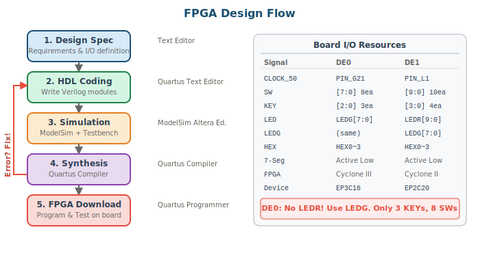

# 1주차: 강의 소개 및 실습환경 구축

## 1-1. [Mon] 강의 개요 (70min)

### 학습 목표

- 강의 전체 로드맵과 평가 방법을 이해한다
- FPGA 설계 흐름(Design Flow)의 각 단계를 설명할 수 있다
- DE0/DE1 보드의 I/O 리소스 차이를 파악하고 Verilog 포트와 매핑할 수 있다

### 1. FPGA Design Flow



디지털 시스템을 FPGA에 구현하려면 다음의 체계적인 설계 흐름을 따른다:

1. **Design Spec** — 구현할 회로의 기능, 입출력, 타이밍 요구사항을 문서화
2. **HDL Coding** — 스펙에 따라 Verilog 코드를 작성
3. **Simulation** — ModelSim에서 Testbench로 논리적 동작을 검증 (합성 전 필수!)
4. **Synthesis** — Quartus Compiler가 Verilog를 게이트 수준 회로로 변환
5. **FPGA Download** — 합성된 회로를 보드에 다운로드하고 실제 동작 확인

> ⚠️ **WARNING:** 시뮬레이션 없이 바로 합성·다운로드하는 것은 가장 흔한 실수이다. 반드시 ModelSim에서 먼저 검증하라.

### 2. Board Introduction (DE0 / DE1)

> ⚠️ **CRITICAL:** DE0과 DE1은 스위치/버튼/LED 개수와 이름이 다르다!
> - **DE0:** SW[7:0] (8개), KEY[2:0] (3개), **LEDG[7:0]** (녹색 8개, LEDR 없음!)
> - **DE1:** SW[9:0] (10개), KEY[3:0] (4개), LEDR[9:0] + LEDG[7:0]

**DE0 Top Module Port Template (Cyclone III):**
```verilog
module de0_top(
    input        CLOCK_50,     // 50MHz (PIN_G21)
    input  [7:0] SW,           // 8 toggle switches
    input  [2:0] KEY,          // 3 push buttons (Active Low!)
    output [7:0] LEDG,         // 8 green LEDs
    output [6:0] HEX0, HEX1, HEX2, HEX3  // 7-seg (Active Low)
);
```

**DE1 Top Module Port Template (Cyclone II):**
```verilog
module de1_top(
    input         CLOCK_50,    // 50MHz (PIN_L1)
    input   [9:0] SW,          // 10 toggle switches
    input   [3:0] KEY,         // 4 push buttons (Active Low!)
    output  [9:0] LEDR,        // 10 red LEDs
    output  [7:0] LEDG,        // 8 green LEDs
    output  [6:0] HEX0, HEX1, HEX2, HEX3  // 7-seg (Active Low)
);
```

> 📝 **NOTE:** 두 보드 공통: KEY는 Active Low (눌렀을 때 0), 7-Segment는 Active Low (0이면 ON). HEX[6:0] = {g,f,e,d,c,b,a}.

### 3. 강의 로드맵 및 평가

- 전반부(1~7주): Verilog 복습 → FSM 응용 설계 → 핸드코딩 능력 강화
- 중반부(9~10주): 팀 프로젝트 (설계·구현·검증·시연)
- 후반부(11~13주): AI 활용 Verilog 코딩 (편리함 + 위험성 체험)

**평가:** 중간 25% + 기말 30% + 프로젝트 20% + 과제 15% + AI보고서 5% + 출석 5%

---

## 1-2. [Wed] Lab: 환경 셋업 및 첫 설계 (70min)

### Step 1: Quartus Project Creation

1. File → New Project Wizard → 프로젝트 이름: `week1_led_test`
2. **DE0:** Device Family: Cyclone III, Device: **EP3C16F484C6**
3. **DE1:** Device Family: Cyclone II, Device: **EP2C20F484C7**
4. EDA Tool: Simulation → ModelSim-Altera, Format → Verilog HDL

### Step 2: LED Test Code

**DE0 version:**
```verilog
// DE0: SW[7:0] -> LEDG[7:0] (green LEDs)
module led_test(
    input  [7:0] SW,
    output [7:0] LEDG
);
    assign LEDG = SW;
endmodule
```

**DE1 version:**
```verilog
// DE1: SW[9:0] -> LEDR[9:0] (red LEDs)
module led_test(
    input  [9:0] SW,
    output [9:0] LEDR
);
    assign LEDR = SW;
endmodule
```

### Step 3: Pin Assignment (.qsf Templates)

> 💡 **TIP:** 아래 핀 배정을 보드별로 `de0_pins.qsf`, `de1_pins.qsf`로 저장해두면 Assignments → Import Assignments로 재사용할 수 있다.

**DE0 Pin Assignment (Cyclone III EP3C16F484C6):**
```tcl
# Clock
set_location_assignment PIN_G21 -to CLOCK_50
# Switches SW[7:0]
set_location_assignment PIN_J6  -to SW[0]
set_location_assignment PIN_H5  -to SW[1]
set_location_assignment PIN_H6  -to SW[2]
set_location_assignment PIN_G4  -to SW[3]
set_location_assignment PIN_G5  -to SW[4]
set_location_assignment PIN_J7  -to SW[5]
set_location_assignment PIN_H7  -to SW[6]
set_location_assignment PIN_E3  -to SW[7]
# LEDs LEDG[7:0]
set_location_assignment PIN_J1  -to LEDG[0]
set_location_assignment PIN_J2  -to LEDG[1]
set_location_assignment PIN_J3  -to LEDG[2]
set_location_assignment PIN_H1  -to LEDG[3]
set_location_assignment PIN_F2  -to LEDG[4]
set_location_assignment PIN_E1  -to LEDG[5]
set_location_assignment PIN_C1  -to LEDG[6]
set_location_assignment PIN_C2  -to LEDG[7]
# KEYs [2:0] (Active Low)
set_location_assignment PIN_H2  -to KEY[0]
set_location_assignment PIN_G3  -to KEY[1]
set_location_assignment PIN_F1  -to KEY[2]
# 7-Seg HEX0~3 (see full template in appendix)
set_location_assignment PIN_E11 -to HEX0[0]
set_location_assignment PIN_F11 -to HEX0[1]
set_location_assignment PIN_H12 -to HEX0[2]
set_location_assignment PIN_H13 -to HEX0[3]
set_location_assignment PIN_G12 -to HEX0[4]
set_location_assignment PIN_F12 -to HEX0[5]
set_location_assignment PIN_F13 -to HEX0[6]
```

**DE1 Pin Assignment (Cyclone II EP2C20F484C7):**
```tcl
# Clock
set_location_assignment PIN_L1  -to CLOCK_50
# Switches SW[9:0]
set_location_assignment PIN_L22 -to SW[0]
set_location_assignment PIN_L21 -to SW[1]
set_location_assignment PIN_M22 -to SW[2]
set_location_assignment PIN_V12 -to SW[3]
set_location_assignment PIN_W12 -to SW[4]
set_location_assignment PIN_U12 -to SW[5]
set_location_assignment PIN_U11 -to SW[6]
set_location_assignment PIN_M2  -to SW[7]
set_location_assignment PIN_M1  -to SW[8]
set_location_assignment PIN_L2  -to SW[9]
# LEDs LEDR[9:0]
set_location_assignment PIN_R20 -to LEDR[0]
set_location_assignment PIN_R19 -to LEDR[1]
set_location_assignment PIN_U19 -to LEDR[2]
set_location_assignment PIN_Y19 -to LEDR[3]
set_location_assignment PIN_T18 -to LEDR[4]
set_location_assignment PIN_V19 -to LEDR[5]
set_location_assignment PIN_Y18 -to LEDR[6]
set_location_assignment PIN_U18 -to LEDR[7]
set_location_assignment PIN_R18 -to LEDR[8]
set_location_assignment PIN_R17 -to LEDR[9]
# LEDs LEDG[7:0]
set_location_assignment PIN_U22 -to LEDG[0]
set_location_assignment PIN_U21 -to LEDG[1]
set_location_assignment PIN_V22 -to LEDG[2]
set_location_assignment PIN_V21 -to LEDG[3]
set_location_assignment PIN_W22 -to LEDG[4]
set_location_assignment PIN_W21 -to LEDG[5]
set_location_assignment PIN_Y22 -to LEDG[6]
set_location_assignment PIN_Y21 -to LEDG[7]
# KEYs [3:0] (Active Low)
set_location_assignment PIN_R22 -to KEY[0]
set_location_assignment PIN_R21 -to KEY[1]
set_location_assignment PIN_T22 -to KEY[2]
set_location_assignment PIN_T21 -to KEY[3]
# 7-Seg HEX0
set_location_assignment PIN_J2  -to HEX0[0]
set_location_assignment PIN_J1  -to HEX0[1]
set_location_assignment PIN_H2  -to HEX0[2]
set_location_assignment PIN_H1  -to HEX0[3]
set_location_assignment PIN_F2  -to HEX0[4]
set_location_assignment PIN_F1  -to HEX0[5]
set_location_assignment PIN_E2  -to HEX0[6]
```

### Step 4: Testbench

```verilog
`timescale 1ns/1ps
module led_test_tb;
    // Use wider bus to test both board versions
    reg  [9:0] sw;
    wire [9:0] ledr;

    // Instantiate DE1 version (wider)
    led_test uut(.SW(sw), .LEDR(ledr));

    integer errors = 0, i;
    initial begin
        $display("=== LED Test Start ===");
        for (i = 0; i < 10; i = i + 1) begin
            sw = (1 << i); #100;
            if (ledr !== sw) begin
                $display("FAIL: sw=%b ledr=%b", sw, ledr);
                errors = errors + 1;
            end
        end
        sw = 10'h3FF; #100;
        sw = 10'h000; #100;
        $display("=== Done: %0d errors ===", errors);
        $finish;
    end
    initial begin $dumpfile("led.vcd"); $dumpvars(0, led_test_tb); end
endmodule
```

### Step 5: Compile & Download

1. Processing → Start Compilation (Ctrl+L)
2. Check Warnings (especially "inferred latch")
3. Tools → Programmer → USB-Blaster → .sof download
4. Toggle switches and verify LED response

### Step 6: Extended — 2's Complement + 7-Segment

> 📝 **NOTE (수정):** 이전 버전은 SW[9], LEDR 사용으로 DE0에서 불가했다. 아래는 보드 독립적 모듈 + 보드별 Top으로 분리.

**Core module (board-independent):**
```verilog
module twos_complement(
    input  [3:0] data_in,
    input        mode,      // 1: pass-through, 0: complement
    output [3:0] result,
    output [6:0] hex_in,    // 7-seg for input
    output [6:0] hex_out    // 7-seg for result
);
    assign result = mode ? data_in : (~data_in + 4'b1);
    seg7_decoder u0(.hex(result),  .seg(hex_out));
    seg7_decoder u1(.hex(data_in), .seg(hex_in));
endmodule
```

**DE0 Top:**
```verilog
module twos_comp_de0(
    input  [7:0] SW, input [2:0] KEY,
    output [7:0] LEDG, output [6:0] HEX0, HEX1
);
    wire [3:0] result;
    twos_complement u_tc(
        .data_in(SW[3:0]), .mode(SW[7]),
        .result(result), .hex_in(HEX1), .hex_out(HEX0)
    );
    assign LEDG = {SW[7], 3'b0, result};
endmodule
```

**DE1 Top:**
```verilog
module twos_comp_de1(
    input  [9:0] SW, input [3:0] KEY,
    output [9:0] LEDR, output [6:0] HEX0, HEX1
);
    wire [3:0] result;
    twos_complement u_tc(
        .data_in(SW[3:0]), .mode(SW[9]),
        .result(result), .hex_in(HEX1), .hex_out(HEX0)
    );
    assign LEDR = {SW[9], 5'b0, result};
endmodule
```

**seg7_decoder module:**
```verilog
module seg7_decoder(
    input      [3:0] hex,
    output reg [6:0] seg   // {g,f,e,d,c,b,a}, active low
);
    always @(*) begin
        case(hex)
            4'h0: seg = 7'b100_0000;  4'h1: seg = 7'b111_1001;
            4'h2: seg = 7'b010_0100;  4'h3: seg = 7'b011_0000;
            4'h4: seg = 7'b001_1001;  4'h5: seg = 7'b001_0010;
            4'h6: seg = 7'b000_0010;  4'h7: seg = 7'b111_1000;
            4'h8: seg = 7'b000_0000;  4'h9: seg = 7'b001_0000;
            4'hA: seg = 7'b000_1000;  4'hB: seg = 7'b000_0011;
            4'hC: seg = 7'b100_0110;  4'hD: seg = 7'b010_0001;
            4'hE: seg = 7'b000_0110;  4'hF: seg = 7'b000_1110;
            default: seg = 7'b111_1111;
        endcase
    end
endmodule
```

### 1주차 과제

**과제 1-1 (필수):** 2의 보수 변환기 Self-Checking TB (16가지 입력 전수 검증) + 보드 동작 사진

**과제 1-2 (가산점):** SW[7:0]을 signed로 해석하여 음수면 HEX3에 '-' 표시, 절대값을 10진수로 HEX1:HEX0에 표시

제출물: .v 소스 + TB, 시뮬레이션 캡처, 보드 사진, 간단한 설명 문서
