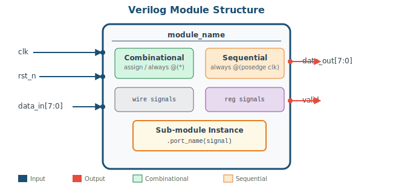
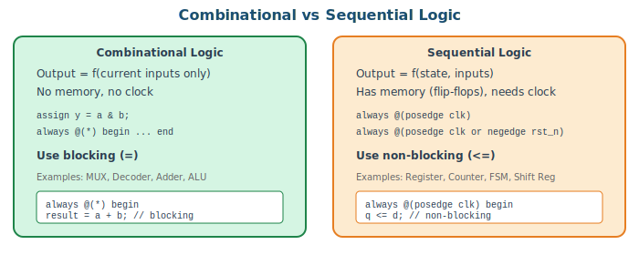
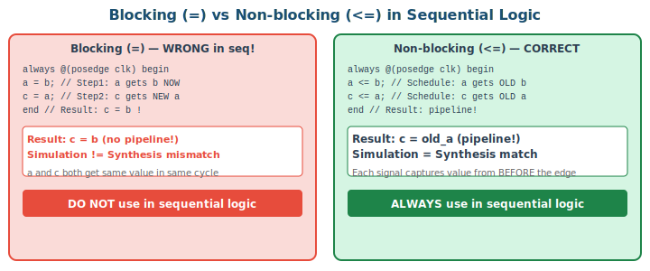
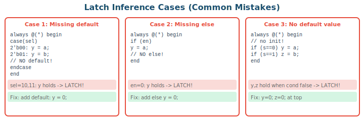

# 2주차: Verilog 핵심 문법 복습

## 2-1. [Mon] 조합논리와 순차논리 (70min)

### 학습 목표

- Verilog 모듈의 구조(포트, wire, reg)를 정확히 설명할 수 있다
- 조합논리와 순차논리의 차이를 이해하고 올바른 코딩 패턴을 적용할 수 있다
- blocking(=)과 non-blocking(<=) 할당의 차이를 시뮬레이션/합성 관점에서 설명할 수 있다

### 1. Verilog Module Structure



**Core Rules:**
- `input` ports are always `wire` inside the module (no declaration needed)
- `output` driven by `always` block → must declare as `reg`
- `output` driven by `assign` → default `wire` type
- Internal: `assign` target → `wire`, `always` target → `reg`

```verilog
module example(
    input        clk,          // wire (auto)
    input  [7:0] data_in,     // wire (auto)
    output [7:0] combo_out,   // wire (assign)
    output reg [7:0] seq_out  // reg  (always)
);
    wire [7:0] int_w;  // assign target
    reg  [7:0] int_r;  // always target

    assign combo_out = data_in & 8'hFF;     // wire OK
    assign int_w     = data_in + 8'd1;      // wire OK
    always @(posedge clk) begin
        seq_out <= data_in;                   // reg OK
        int_r   <= int_w;                     // reg OK
    end
endmodule
```

### 2. Combinational vs Sequential Logic



**Combinational patterns:**
```verilog
// Pattern 1: assign (simple logic)
assign y = sel ? b : a;           // 2:1 MUX
assign sum = a + b;               // Adder

// Pattern 2: always @(*) (complex logic)
// Rule: use blocking (=), default + default required
always @(*) begin
    result = 8'd0;           // DEFAULT value (prevents latch!)
    case(opcode)
        3'b000: result = a + b;
        3'b001: result = a - b;
        3'b010: result = a & b;
        default: result = 8'd0;  // DEFAULT case required!
    endcase
end
```

**Sequential patterns:**
```verilog
// Pattern A: Synchronous Reset
always @(posedge clk) begin
    if (!rst_n) q <= 8'd0;
    else        q <= d;
end

// Pattern B: Asynchronous Reset (recommended for DE0/DE1 KEYs)
always @(posedge clk or negedge rst_n) begin
    if (!rst_n) q <= 8'd0;   // immediate reset when rst_n=0
    else        q <= d;
end
```

### 3. Blocking vs Non-blocking (Critical!)



```verilog
// ═══════════════════════════════════════════
// ABSOLUTE RULES:
// 1. Combinational (always @(*))  -> blocking (=)
// 2. Sequential    (always @(posedge)) -> non-blocking (<=)
// 3. NEVER mix = and <= in same always block
// 4. NEVER drive same signal from multiple always blocks
// ═══════════════════════════════════════════
```

> ⚠️ **WARNING:** blocking/non-blocking 혼용은 시뮬레이션에서 동작하는 것처럼 보이지만, 합성 결과가 다를 수 있다 (Simulation ≠ Synthesis). 가장 찾기 어려운 버그!

### 4. Latch Inference Prevention



```verilog
// GOLDEN RULE: In always @(*) blocks:
//   1. Assign default values for ALL outputs at the top
//   2. Include default in every case statement
//   3. Never omit else in if-else chains

always @(*) begin
    grant = 3'd0;   // <- default alone prevents 99% of latches
    valid = 1'b0;
    case(request)
        8'b???????1: begin grant = 3'd0; valid = 1'b1; end
        8'b??????10: begin grant = 3'd1; valid = 1'b1; end
        default: ;   // OK because defaults already assigned
    endcase
end
```

> 💡 **TIP:** Quartus 합성 후 Warning에서 "inferred latch" 메시지를 반드시 확인하고 수정하라. 의도적 래치가 아니면 100% 버그이다.

---

## 2-2. [Wed] Lab: 코딩 연습 (70min)

### Lab 1: 8-bit Adder/Subtractor

```verilog
module add_sub_8bit(
    input  [7:0] a, b,
    input        sub,       // 0: add, 1: subtract
    output [8:0] result,    // 9-bit (MSB = carry)
    output       overflow,  // signed overflow
    output       zero
);
    wire [7:0] b_xor = b ^ {8{sub}};
    // sub=1: a + ~b + 1 = a - b (2's complement)
    assign result   = {1'b0, a} + {1'b0, b_xor} + {8'b0, sub};
    assign overflow = (a[7] == b_xor[7]) && (result[7] != a[7]);
    assign zero     = (result[7:0] == 8'b0);
endmodule
```

### Lab 1: Testbench

```verilog
`timescale 1ns/1ps
module add_sub_8bit_tb;
    reg  [7:0] a, b;
    reg        sub;
    wire [8:0] result;
    wire       overflow, zero;

    add_sub_8bit uut(.*);
    integer errors = 0;

    task test_op;
        input [7:0] ta, tb; input tsub;
        reg [8:0] exp;
        begin
            a = ta; b = tb; sub = tsub; #10;
            if (tsub) exp = {1'b0,ta} + {1'b0,(~tb)} + 9'd1;
            else      exp = {1'b0,ta} + {1'b0,tb};
            if (result !== exp) begin
                $display("FAIL: %0d %s %0d = %0d (exp %0d)",
                    ta, tsub ? "-" : "+", tb, result, exp);
                errors = errors + 1;
            end
        end
    endtask

    initial begin
        $display("=== Adder/Subtractor Test ===");
        test_op(100, 55, 0);  // 155
        test_op(255, 1,  0);  // 256 (carry)
        test_op(127, 1,  0);  // 128 (signed overflow)
        test_op(100, 55, 1);  // 45
        test_op(0,   1,  1);  // -1 = 255
        test_op(50,  50, 1);  // 0 (zero flag)
        test_op(8'hFF, 8'hFF, 0); // 510
        test_op(8'h80, 1, 1);     // -128-1 (signed overflow)
        $display("Done: %0d errors", errors);
        $finish;
    end
endmodule
```

> 📝 **NOTE (수정):** 이전 TB에서 `exp = ta + tb`로 했는데, 이 경우 implicit width에 의해 결과가 틀릴 수 있다. `{1'b0,ta}+{1'b0,tb}`로 명시적 9비트 확장을 사용해야 정확하다.

### Lab 2: 4-bit Up/Down Counter

```verilog
module counter_4bit(
    input        clk, rst_n, up_down,
    output reg [3:0] count,
    output       max_tick, min_tick
);
    always @(posedge clk or negedge rst_n) begin
        if (!rst_n)        count <= 4'h0;
        else if (up_down)  count <= count + 4'h1;
        else               count <= count - 4'h1;
    end
    assign max_tick = (count == 4'hF);
    assign min_tick = (count == 4'h0);
endmodule
```

### Counter Testbench (추가)

```verilog
`timescale 1ns/1ps
module counter_4bit_tb;
    reg clk, rst_n, up_down;
    wire [3:0] count;
    wire max_tick, min_tick;

    counter_4bit uut(.*);
    initial clk = 0;
    always #10 clk = ~clk;

    integer errors = 0;

    initial begin
        // Reset test
        rst_n = 0; up_down = 1;
        repeat(3) @(posedge clk); #1;
        if (count !== 4'h0) begin
            $display("FAIL: reset count=%h", count); errors=errors+1;
        end

        // Count up
        rst_n = 1;
        repeat(16) @(posedge clk);
        #1;
        if (count !== 4'h0) begin // should wrap around to 0
            $display("FAIL: wrap count=%h", count); errors=errors+1;
        end

        // Check max_tick
        repeat(15) @(posedge clk); #1;
        if (!max_tick) begin
            $display("FAIL: max_tick not set at F"); errors=errors+1;
        end

        // Count down
        up_down = 0;
        repeat(2) @(posedge clk); #1;
        if (count !== 4'hD) begin
            $display("FAIL: down count=%h exp=D", count); errors=errors+1;
        end

        $display("Counter test: %0d errors", errors);
        $finish;
    end

    initial begin $dumpfile("counter.vcd"); $dumpvars(0, counter_4bit_tb); end
endmodule
```

### Counter Board Top Module

> ⚠️ **BOARD NOTE:** DE0과 DE1의 포트가 다르므로 Top Module 분리.

**DE0 version:**
```verilog
module counter_de0(
    input  [7:0] SW, input [2:0] KEY,
    output [7:0] LEDG, output [6:0] HEX0
);
    wire [3:0] count; wire max_tick, min_tick;
    counter_4bit u_cnt(
        .clk(~KEY[0]),       // press = posedge
        .rst_n(KEY[1]),
        .up_down(SW[0]),
        .count(count),
        .max_tick(max_tick), .min_tick(min_tick)
    );
    assign LEDG = {max_tick, min_tick, 2'b0, count};
    seg7_decoder u_h0(.hex(count), .seg(HEX0));
endmodule
```

**DE1 version:**
```verilog
module counter_de1(
    input  [9:0] SW, input [3:0] KEY,
    output [9:0] LEDR, output [6:0] HEX0
);
    wire [3:0] count; wire max_tick, min_tick;
    counter_4bit u_cnt(
        .clk(~KEY[0]),
        .rst_n(KEY[1]),
        .up_down(SW[0]),
        .count(count),
        .max_tick(max_tick), .min_tick(min_tick)
    );
    assign LEDR = {max_tick, min_tick, 4'b0, count};
    seg7_decoder u_h0(.hex(count), .seg(HEX0));
endmodule
```

> 📝 **NOTE:** `~KEY[0]` 반전 이유: 두 보드 모두 KEY는 Active Low. 누르면 0→뗄 때 1. 반전하면 누를 때 posedge 발생.

### Lab 3: Generic Counter with parameter

```verilog
module counter_nbit #(
    parameter WIDTH   = 4,
    parameter MAX_VAL = (1 << WIDTH) - 1
)(
    input                    clk, rst_n, enable,
    output reg [WIDTH-1:0]   count,
    output                   max_tick
);
    always @(posedge clk or negedge rst_n) begin
        if (!rst_n)
            count <= {WIDTH{1'b0}};
        else if (enable)
            count <= (count == MAX_VAL[WIDTH-1:0]) ?
                     {WIDTH{1'b0}} : count + 1'b1;
    end
    assign max_tick = (count == MAX_VAL[WIDTH-1:0]) && enable;
endmodule

// Usage:
// counter_nbit #(.WIDTH(8)) u8(.clk(clk), ...);
// counter_nbit #(.WIDTH(24), .MAX_VAL(49_999_999)) u_1sec(..);
```

> 💡 **TIP:** WIDTH=24, MAX_VAL=49,999,999로 설정하면 50MHz에서 정확히 1초 주기의 tick을 얻을 수 있다.

### 2주차 과제

**과제 2-1 (필수): 8-bit Barrel Shifter**
- 입력: data[7:0], shift_amt[2:0], direction (0:left, 1:right)
- 조합논리 구현 + Self-Checking TB (모든 shift_amt × 양방향 × 5패턴 이상)
- DE0: SW[7:0]=data, SW[2:0]=shift (KEY[0] area), KEY[1]=direction, LEDG[7:0]=result
- DE1: SW[7:0]=data, SW[9:8]+KEY[0] for shift, KEY[1]=direction, LEDR[7:0]=result

**과제 2-2 (필수): Decoder + Encoder**
- 3-to-8 Decoder + 8-to-3 Priority Encoder 각각 설계 후 루프백 검증

**과제 2-3 (가산점):** 24-bit counter로 1초 LED 깜빡임 구현 (보드 동영상 제출)
