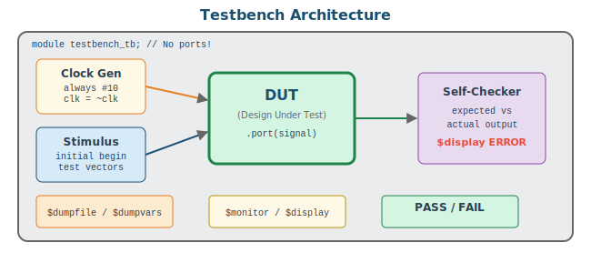
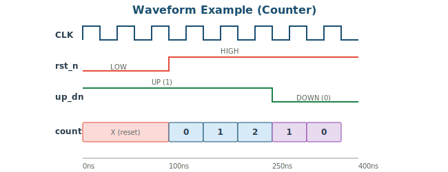
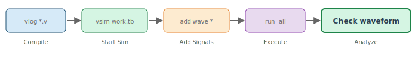

# 3주차: 시뮬레이션 및 검증 복습

## 3-1. [Mon] Testbench 작성법 (70min)

### 학습 목표

- Testbench 아키텍처의 6가지 구성 요소를 설명할 수 있다
- Self-Checking TB를 작성하여 자동 검증할 수 있다
- task/function을 활용하여 재사용 가능한 TB를 작성할 수 있다

### 1. Testbench Architecture



Testbench는 합성 대상이 아니므로 `initial`, `#delay`, `$display` 등 시뮬레이션 전용 구문을 자유롭게 사용할 수 있다.

**6가지 필수 구성 요소:**

1. **Signal Declaration** — DUT 입력은 `reg`, 출력은 `wire`
2. **DUT Instantiation** — 포트 이름 매핑 `.port(signal)` 방식
3. **Clock Generation** — `always #(PERIOD/2) clk = ~clk`
4. **Reset Sequence** — 초기 LOW → 일정 시간 후 HIGH 해제
5. **Test Scenario** — 입력 인가 + 예상 출력 비교 (Self-Checking)
6. **Waveform Dump** — `$dumpfile` / `$dumpvars` (VCD 파일 생성)

### 2. 범용 Testbench 템플릿

```verilog
`timescale 1ns/1ps
module DUT_NAME_tb;
    //---- 1. Signals ----
    reg         clk, rst_n;
    reg  [7:0]  data_in;
    wire [7:0]  data_out;

    //---- 2. DUT ----
    DUT_NAME uut(
        .clk(clk), .rst_n(rst_n),
        .data_in(data_in), .data_out(data_out)
    );

    //---- 3. Clock (50MHz = 20ns period) ----
    localparam CLK_P = 20;
    initial clk = 0;
    always #(CLK_P/2) clk = ~clk;

    //---- 4. Error counter ----
    integer errors = 0, tests = 0;

    //---- 5. Check task ----
    task check;
        input [7:0] exp;
        input [127:0] msg;
        begin
            tests = tests + 1;
            if (data_out !== exp) begin
                $display("[FAIL] %0s: got=%h exp=%h @%0t",
                         msg, data_out, exp, $time);
                errors = errors + 1;
            end
        end
    endtask

    //---- 6. Reset task ----
    task do_reset;
        begin
            rst_n = 0; data_in = 0;
            repeat(3) @(posedge clk);
            rst_n = 1; @(posedge clk);
        end
    endtask

    //---- 7. Main test ----
    initial begin
        do_reset;
        data_in = 8'hAA; @(posedge clk); #1;
        check(8'hAA, "test1");
        // ... more tests ...
        repeat(5) @(posedge clk);
        $display("Tests:%0d Errors:%0d", tests, errors);
        if (errors == 0) $display("*** ALL PASSED ***");
        $finish;
    end

    //---- 8. VCD dump ----
    initial begin
        $dumpfile("DUT_NAME.vcd");
        $dumpvars(0, DUT_NAME_tb);
    end

    //---- 9. Timeout guard ----
    initial begin #1_000_000; $display("TIMEOUT!"); $finish; end
endmodule
```

> 💡 **TIP:** `@(posedge clk); #1;` 패턴은 클럭 에지 후 1ns 대기하여 non-blocking 할당이 완료된 안정 상태에서 검증하기 위함이다.

### 3. task vs function

| 항목 | task | function |
|------|------|----------|
| 시간 지연 | 가능 (`@`, `#`) | 불가 |
| 반환값 | 없음 (output 인수) | 있음 (1개) |
| 합성 가능 | 아니오 | 예 (조합논리) |
| 용도 | TB에서 반복 시나리오 | 기대값 계산 모델 |

```verilog
// task: 시간 경과 포함 (시뮬레이션 전용)
task send_byte;
    input [7:0] val;
    integer i;
    begin
        for (i = 7; i >= 0; i = i - 1) begin
            serial_in = val[i];
            @(posedge clk);
        end
    end
endtask

// function: 순수 조합논리 (합성 가능)
function [7:0] alu_model;
    input [7:0] a, b;
    input [2:0] op;
    begin
        case(op)
            3'b000: alu_model = a + b;
            3'b001: alu_model = a - b;
            3'b010: alu_model = a & b;
            default: alu_model = 8'h00;
        endcase
    end
endfunction
```

### 4. 대량 랜덤 테스트

```verilog
integer seed = 42, i;
reg [7:0] ra, rb; reg [2:0] rop;
initial begin
    do_reset;
    for (i = 0; i < 1000; i = i + 1) begin
        ra  = $random(seed);
        rb  = $random(seed);
        rop = $random(seed) & 3'b111;  // 명시적 마스킹!
        a = ra; b = rb; op = rop;
        @(posedge clk); #1;
        if (result !== alu_model(ra, rb, rop)) begin
            $display("FAIL[%0d] a=%h b=%h op=%b res=%h exp=%h",
                     i, ra, rb, rop, result, alu_model(ra, rb, rop));
            errors = errors + 1;
        end
    end
    $display("Random 1000 tests: %0d errors", errors);
end
```

> 📝 **NOTE:** `$random`은 32비트 signed 값을 반환한다. 3비트 op에 사용할 때 `& 3'b111`로 명시적 마스킹하는 것이 안전하다. 암묵적 truncation에 의존하면 의도하지 않은 값이 들어갈 수 있다.

---

## 3-2. [Wed] ModelSim 실습 (70min)

### ModelSim Waveform 분석



### ModelSim 실습 절차 (Step-by-step)



1. Quartus → Tools → Run Simulation Tool → RTL Simulation
2. ModelSim 콘솔에서 컴파일 확인: `vlog *.v`
3. 시뮬레이션 시작: `vsim work.<testbench_name>`
4. 파형 창에 신호 추가: `add wave -r /*`
5. 시뮬레이션 실행: `run -all` 또는 `run 1000ns`
6. 파형 분석: 확대/축소, 커서, 간격 측정

### ModelSim 핵심 명령어

```tcl
# === Compile & Run ===
vlog *.v                     # Compile all Verilog files
vsim work.counter_4bit_tb    # Start simulation
add wave -r /*               # Add all signals recursively
run -all                     # Run until $finish
run 500ns                    # Run for 500ns
restart                      # Restart simulation

# === Waveform Control ===
wave zoom full               # Zoom to show all
wave zoom range 0ns 200ns    # Zoom to specific range

# === DO file example (save as run_sim.do) ===
# vlog *.v
# vsim work.pwm_generator_tb
# add wave -r /*
# run -all
```

> 💡 **TIP:** `.do` 파일을 만들어 반복 작업을 자동화하면 효율적이다. ModelSim 콘솔에서 `do run_sim.do`로 실행한다.

### 실습: PWM Generator

PWM(Pulse Width Modulation)은 디지털 신호로 아날로그 효과(LED 밝기, 모터 속도)를 내는 기법이다.

```verilog
//----------------------------------------------------
// PWM Generator: duty[3:0]에 따라 PWM 출력
// duty=0 -> 0%, duty=8 -> 50%, duty=15 -> ~100%
//----------------------------------------------------
module pwm_generator(
    input        clk, rst_n,
    input  [3:0] duty,
    output reg   pwm_out
);
    reg [3:0] counter;

    always @(posedge clk or negedge rst_n) begin
        if (!rst_n) counter <= 4'd0;
        else        counter <= counter + 4'd1;
    end

    always @(posedge clk or negedge rst_n) begin
        if (!rst_n) pwm_out <= 1'b0;
        else        pwm_out <= (counter < duty);
    end
endmodule
```

### PWM Self-Checking Testbench

```verilog
`timescale 1ns/1ps
module pwm_generator_tb;
    reg        clk, rst_n;
    reg  [3:0] duty;
    wire       pwm_out;

    pwm_generator uut(.*);
    initial clk = 0;
    always #10 clk = ~clk;

    integer errors = 0, high_cnt, d;

    task measure_duty_cycle;
        input [3:0] test_d;
        output integer h;
        begin
            h = 0;
            repeat(16) begin
                @(posedge clk); #1;
                if (pwm_out) h = h + 1;
            end
        end
    endtask

    initial begin
        rst_n = 0; duty = 0;
        repeat(5) @(posedge clk); rst_n = 1;
        repeat(20) @(posedge clk);  // wait for counter sync

        for (d = 0; d <= 15; d = d + 1) begin
            duty = d;
            repeat(16) @(posedge clk); // sync to counter cycle
            measure_duty_cycle(d, high_cnt);
            if (high_cnt !== d) begin
                $display("[FAIL] duty=%0d: high=%0d/16", d, high_cnt);
                errors = errors + 1;
            end else
                $display("[PASS] duty=%0d: %0d%% (%0d/16)",
                         d, d*100/16, high_cnt);
        end
        $display("Done: %0d errors", errors);
        $finish;
    end

    initial begin $dumpfile("pwm.vcd"); $dumpvars(0, pwm_generator_tb); end
endmodule
```

### PWM Board Top Module

> ⚠️ **BOARD NOTE:** DE0과 DE1의 포트가 다르므로 Top Module이 다릅니다.

**DE0 version:**
```verilog
module pwm_top(
    input        CLOCK_50,    // PIN_G21
    input  [7:0] SW,          // 8 switches
    input  [2:0] KEY,         // 3 buttons
    output [7:0] LEDG,        // 8 green LEDs
    output [6:0] HEX0
);
    wire pwm_out;
    pwm_generator u_pwm(
        .clk(CLOCK_50), .rst_n(KEY[0]),
        .duty(SW[3:0]), .pwm_out(pwm_out)
    );
    assign LEDG = {8{pwm_out}};
    seg7_decoder u_hex(.hex(SW[3:0]), .seg(HEX0));
endmodule
```

**DE1 version:**
```verilog
module pwm_top(
    input         CLOCK_50,   // PIN_L1
    input   [9:0] SW,         // 10 switches
    input   [3:0] KEY,        // 4 buttons
    output  [9:0] LEDR,       // 10 red LEDs
    output  [7:0] LEDG,       // 8 green LEDs
    output  [6:0] HEX0
);
    wire pwm_out;
    pwm_generator u_pwm(
        .clk(CLOCK_50), .rst_n(KEY[0]),
        .duty(SW[3:0]), .pwm_out(pwm_out)
    );
    assign LEDR = {10{pwm_out}};
    assign LEDG = 8'b0;
    seg7_decoder u_hex(.hex(SW[3:0]), .seg(HEX0));
endmodule
```

### 3주차 과제

**과제 3-1 (필수): 8-bit PWM 확장**
- duty[7:0], counter 8-bit → 256단계 밝기
- Self-Checking TB: duty=0, 64, 128, 192, 255 검증
- 보드 매핑: SW로 duty 입력, LED로 pwm_out 관찰, HEX에 duty 값 표시

**과제 3-2 (필수): SIPO Shift Register + TB**
- 8-bit Serial-In Parallel-Out 시프트 레지스터
- 입력: clk, rst_n, serial_in, shift_en
- 출력: parallel_out[7:0], done (8비트 수신 완료 1-clk pulse)
- TB에서 send_byte task로 0xA5, 0x3C 전송 후 자동 검증

**과제 3-3 (가산점): LED Breathing Effect**
- PWM duty를 자동으로 0→255→0 반복 (triangle wave)
- fade 속도를 SW로 4단계 조절

---
---
