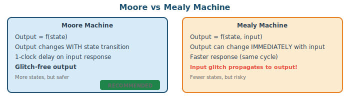
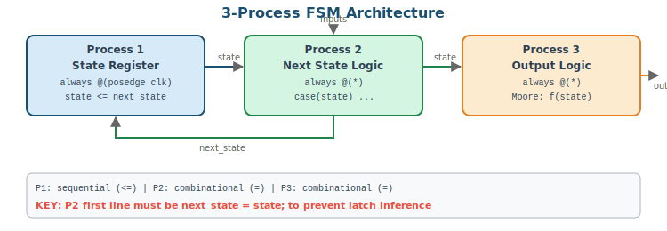
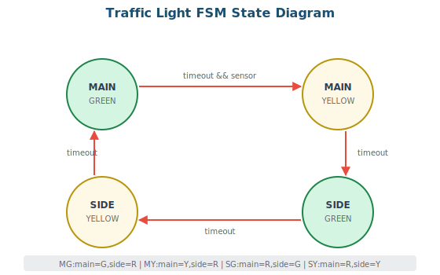
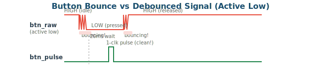
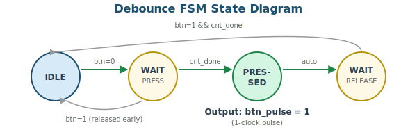
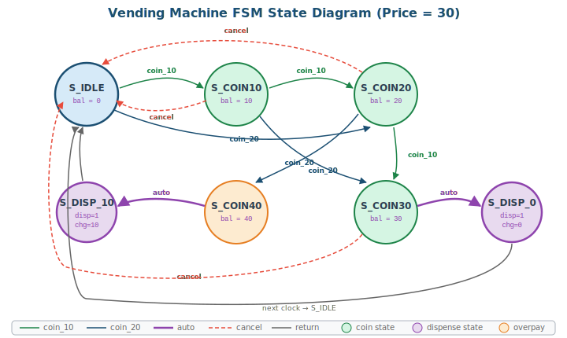
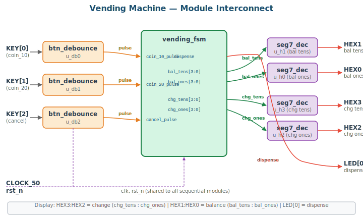

# 4주차: FSM 설계 기초

## 4-1. [Mon] FSM 이론 (70min)

### 학습 목표

- Moore/Mealy 머신의 차이를 설명하고 출력 타이밍 차이를 파형으로 확인할 수 있다
- 3-Process FSM 코딩 스타일로 FSM을 설계할 수 있다
- 버튼 디바운스 회로를 FSM으로 구현할 수 있다

### 1. Moore vs Mealy Machine



| 항목 | Moore | Mealy |
|------|-------|-------|
| Output depends on | State only | State + Input |
| Output timing | Changes with state (1-clk delay) | Changes with input (immediate) |
| # of states | Generally more | Generally fewer |
| Output glitch | Glitch-free | Input glitch can propagate |
| Recommended | ✅ This course | Advanced use only |

> 💡 **TIP:** 본 강의에서는 출력 안정성을 위해 **Moore 방식 + 3-Process 스타일**을 권장한다.

### 2. 3-Process FSM Architecture



3-Process 스타일의 장점: **상태 레지스터**, **전이 논리**, **출력 논리**가 분리되어 가독성과 디버깅이 용이하다.

### 3. 3-Process FSM 코딩 템플릿

```verilog
module fsm_template(
    input      clk, rst_n,
    input      go, done_sig,
    output reg busy, complete
);
    // (1) State encoding — localparam 사용
    localparam IDLE    = 2'b00,
               RUNNING = 2'b01,
               FINISH  = 2'b10;
    reg [1:0] state, next_state;

    // Process 1: State Register (sequential)
    always @(posedge clk or negedge rst_n) begin
        if (!rst_n) state <= IDLE;
        else        state <= next_state;
    end

    // Process 2: Next State Logic (combinational)
    always @(*) begin
        next_state = state;          // ★ DEFAULT: hold current state
        case (state)
            IDLE:    if (go)       next_state = RUNNING;
            RUNNING: if (done_sig) next_state = FINISH;
            FINISH:                next_state = IDLE;
            default:               next_state = IDLE;
        endcase
    end

    // Process 3: Output Logic (combinational, Moore)
    always @(*) begin
        busy     = 1'b0;            // ★ DEFAULT outputs
        complete = 1'b0;
        case (state)
            RUNNING: busy     = 1'b1;
            FINISH:  complete = 1'b1;
            default: ;
        endcase
    end
endmodule
```

> ⚠️ **WARNING:** P2에서 `next_state = state;` 기본값을 빠뜨리면 래치가 생긴다! 반드시 case문 앞에 기본값을 할당하라.

### 4. Traffic Light FSM



```verilog
module traffic_light (
    input        clk, rst_n,
    input        sensor,
    output reg [2:0] light_main,  // {R,Y,G}
    output reg [2:0] light_side   // {R,Y,G}
);
    localparam MAIN_GREEN  = 2'd0, MAIN_YELLOW = 2'd1,
               SIDE_GREEN  = 2'd2, SIDE_YELLOW = 2'd3;
    parameter  GREEN_T  = 26'd49_999_999,                // ✅ parameter로 변경
               YELLOW_T = 26'd24_999_999;

    reg [1:0]  state, next_state;
    reg [25:0] timer;
    wire       timeout = (timer == 0);

    // Timer
    always @(posedge clk or negedge rst_n) begin
        if (!rst_n) begin
            timer <= GREEN_T;
        end else begin
            if (next_state != state)                              // ✅ 오류 수정: state_d 제거
                timer <= (next_state == MAIN_YELLOW || next_state == SIDE_YELLOW)
                         ? YELLOW_T : GREEN_T;                   // ✅ 오류 수정: next_state 기준
            else if (timer > 0)
                timer <= timer - 1;
        end
    end

    // P1: State Register
    always @(posedge clk or negedge rst_n)
        if (!rst_n) state <= MAIN_GREEN;
        else        state <= next_state;

    // P2: Next State
    always @(*) begin
        next_state = state;
        case (state)
            MAIN_GREEN:  if (timeout && sensor) next_state = MAIN_YELLOW;
            MAIN_YELLOW: if (timeout)           next_state = SIDE_GREEN;
            SIDE_GREEN:  if (timeout)           next_state = SIDE_YELLOW;
            SIDE_YELLOW: if (timeout)           next_state = MAIN_GREEN;
            default:                            next_state = MAIN_GREEN;
        endcase
    end

    // P3: Output {R,Y,G}
    always @(*) begin
        light_main = 3'b100; light_side = 3'b100;
        case (state)
            MAIN_GREEN:  begin light_main=3'b001; light_side=3'b100; end
            MAIN_YELLOW: begin light_main=3'b010; light_side=3'b100; end
            SIDE_GREEN:  begin light_main=3'b100; light_side=3'b001; end
            SIDE_YELLOW: begin light_main=3'b100; light_side=3'b010; end
        endcase
    end
endmodule


```

##### Simple Testbench 

```verilog

`timescale 1ns/1ps

module tb_my;
  reg clk,rst_n,sensor;
  wire [2:0] light_main, light_side;

 traffic_light  #( .GREEN_T(5), .YELLOW_T(3))  dut (
        .clk(clk), .rst_n(rst_n), .sensor(sensor),
        .light_main(light_main), .light_side(light_side)
    );

initial clk = 0;
always #5 clk = ~clk;


initial begin
 rst_n = 0;  
 sensor = 0;
 #12  rst_n = 1;
 #200

 sensor = 1;
 #300 $finish;
end

endmodule
```


---

## 4-2. [Wed] 실습: FSM 코딩 (70min)

### 실습 1: Button Debounce FSM

기계식 버튼은 누를 때 수 ms 동안 접점이 떨리며(bouncing) 여러 번의 에지가 발생한다.





```verilog
module btn_debounce (
    input      clk,       // 50MHz
    input      rst_n,     // async reset (added!)
    input      btn_raw,   // raw button (active low)
    output reg btn_pulse  // debounced 1-clk pulse
);
    localparam IDLE=2'd0, WAIT_P=2'd1, PRESSED=2'd2, WAIT_R=2'd3;
    localparam DEBOUNCE_CNT = 20'd999_999; // 20ms @ 50MHz

    reg [1:0]  state, next_state;
    reg [19:0] cnt;
    wire       cnt_done = (cnt == DEBOUNCE_CNT);

    // Counter: reset on state transition or system reset
    always @(posedge clk or negedge rst_n) begin
        if (!rst_n)                  cnt <= 0;
        else if (state != next_state) cnt <= 0;
        else if (!cnt_done)           cnt <= cnt + 1;
    end

    // P1: State Register (with async reset!)
    always @(posedge clk or negedge rst_n) begin
        if (!rst_n) state <= IDLE;
        else        state <= next_state;
    end

    // P2: Next State
    always @(*) begin
        next_state = state;
        case (state)
            IDLE:    if (!btn_raw)            next_state = WAIT_P;
            WAIT_P:  if (btn_raw)             next_state = IDLE;
                     else if (cnt_done)       next_state = PRESSED;
            PRESSED:                          next_state = WAIT_R;
            WAIT_R:  if (btn_raw && cnt_done) next_state = IDLE;
            default:                          next_state = IDLE;
        endcase
    end

    // P3: Output — PRESSED state generates 1-clk pulse
    always @(posedge clk or negedge rst_n) begin
        if (!rst_n) btn_pulse <= 1'b0;
        else        btn_pulse <= (state == PRESSED);
    end
endmodule
```

> ⚠️ **WARNING (수정사항):** 이전 버전에는 `rst_n`이 포트에 없고, P1에 비동기 리셋이 없었다. 리셋 없이는 전원 투입 시 state가 undefined 상태가 되어 정상 동작하지 않는다. 반드시 `rst_n`을 추가하고 모든 sequential 블록에 비동기 리셋을 포함해야 한다.


######  Testbench 
``` verilog
`timescale 1ns/1ps

module btn_debounce_tb;

    reg  clk, rst_n, btn_raw;
    wire btn_pulse;

    btn_debounce #(.DEBOUNCE_CNT(20'd4)) dut (
        .clk      (clk),
        .rst_n    (rst_n),
        .btn_raw  (btn_raw),
        .btn_pulse(btn_pulse)
    );

    initial clk = 0;
    always #10 clk = ~clk;          // 50MHz ? ?? 20ns

    task wait_clk;
        input integer n;
        integer i;
        begin
            for (i = 0; i < n; i = i + 1)
                @(posedge clk);
        end
    endtask

    initial begin

        clk=0; rst_n=0; btn_raw=1;   // btn_raw=1: ?? ???(active low)
        repeat(3) @(posedge clk);        
        rst_n=1;
        repeat(2) @(posedge clk);  
        

        btn_raw = 0;
        wait_clk(8);                 // DEBOUNCE_CNT(4)+??
        btn_raw = 1;
        wait_clk(8);

    end

endmodule
```


### 실습 2: Traffic Light Board Test

위의 traffic_light 모듈을 보드에 구현한다.

**Board mapping:**
| Signal | DE0 | DE1 |
|--------|-----|-----|
| clk | CLOCK_50 (PIN_G21) | CLOCK_50 (PIN_L1) |
| rst_n | KEY[0] | KEY[0] |
| sensor | SW[0] | SW[0] |
| light_main {R,Y,G} | LEDG[2:0] | LEDR[2:0] |
| light_side {R,Y,G} | LEDG[5:3] | LEDR[5:3] |
| state display | HEX0 | HEX0 |

**DE0 Top Module:**
```verilog
module traffic_de0(
    input        CLOCK_50,     // PIN_G21
    input  [7:0] SW,           // SW[0] = sensor
    input  [2:0] KEY,          // KEY[0] = rst
    output [7:0] LEDG,         // {R,Y,G} for main & side
    output [6:0] HEX0, HEX1   // state & timer display
);
    wire [2:0] light_main, light_side;
    wire [1:0] state_mon;      // for display (expose from FSM)

    traffic_light u_tl(
        .clk(CLOCK_50),
        .rst_n(KEY[0]),
        .sensor(SW[0]),
        .light_main(light_main),
        .light_side(light_side)
    );

    // LEDG[2:0] = main {R,Y,G}, LEDG[5:3] = side {R,Y,G}
    assign LEDG = {2'b0, light_side, light_main};

    // HEX0: current state (0~3)
    seg7_decoder u_h0(.hex({2'b0, u_tl.state}), .seg(HEX0));
    // HEX1: blank (or timer seconds if exposed)
    assign HEX1 = 7'b111_1111;  // blank
endmodule
```

**DE1 Top Module:**
```verilog
module traffic_de1(
    input         CLOCK_50,    // PIN_L1
    input   [9:0] SW,          // SW[0] = sensor
    input   [3:0] KEY,         // KEY[0] = rst
    output  [9:0] LEDR,        // {R,Y,G} for main & side
    output  [7:0] LEDG,
    output  [6:0] HEX0, HEX1
);
    wire [2:0] light_main, light_side;

    traffic_light u_tl(
        .clk(CLOCK_50),
        .rst_n(KEY[0]),
        .sensor(SW[0]),
        .light_main(light_main),
        .light_side(light_side)
    );

    // LEDR[2:0] = main {R,Y,G}, LEDR[5:3] = side {R,Y,G}
    assign LEDR = {4'b0, light_side, light_main};
    assign LEDG = 8'b0;

    seg7_decoder u_h0(.hex({2'b0, u_tl.state}), .seg(HEX0));
    assign HEX1 = 7'b111_1111;
endmodule
```

> 💡 **TIP:** `u_tl.state`로 내부 신호를 참조하는 것은 시뮬레이션에서는 동작하지만, 합성 시에는 지원되지 않을 수 있다. 확실한 방법은 traffic_light 모듈에 `output [1:0] state_out`을 추가하는 것이다.

### 4주차 과제

**과제 4-1 (필수): Vending Machine FSM**




**Module Hierarchy:**



설계할 모듈 구조:
- `vending_top` (Board Top) — DE0 또는 DE1용 핀 연결
  - `btn_debounce` × 3 — coin_10, coin_20, cancel 각각 디바운스
  - `vending_fsm` — 3-Process FSM 핵심 로직
    - P1: State Register
    - P2: Next State Logic (IDLE→COIN10→COIN20→COIN30→DISPENSE)
    - P3: Output Logic (dispense, change, current balance)
  - `seg7_decoder` × 2 — 투입금과 거스름돈 표시

**Requirements:**
- States: IDLE → COIN_10 → COIN_20 → COIN_30 → DISPENSE
- Inputs: coin_10, coin_20, cancel (KEY + debounce)
- Outputs: dispense, change[4:0], 투입금을 HEX에 표시
- coin_20 from COIN_20 state → DISPENSE (초과 투입 시 change 출력)
- cancel: any COIN state → IDLE (투입금 반환)
- 3-Process FSM + Self-Checking TB + Board demo

> 💡 **TIP:** 먼저 `vending_fsm` 모듈을 단독으로 설계하고 TB로 검증한 후, `vending_top`에서 debounce와 seg7_decoder를 연결하여 보드 테스트하라. 모듈 분리 설계의 핵심은 **각 모듈을 독립적으로 검증**하는 것이다.

---
---
