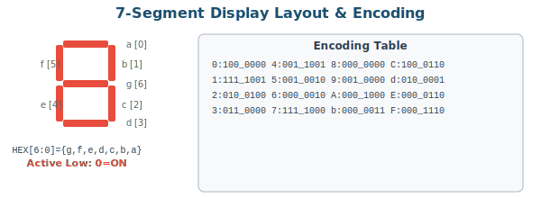
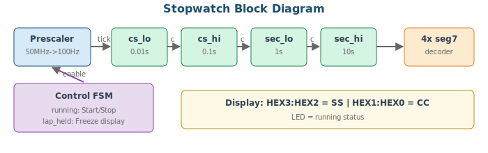
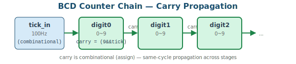

# 5주차: FSM 응용 및 7-Segment 제어

## 5-1. [Mon] 7-Segment Decoder & Stopwatch (70min)

### 학습 목표

- 7-Segment 디스플레이의 세그먼트 매핑을 이해한다
- BCD 카운터 체인을 설계하여 시간 표시에 활용할 수 있다
- Prescaler를 이용하여 50MHz를 원하는 주파수로 분주할 수 있다

### 1. 7-Segment Display Structure



> 📝 **NOTE:** 두 보드 모두 7-seg는 **Active Low**: 세그먼트를 켜려면 0, 끄려면 1을 출력. HEX[6:0] = {g,f,e,d,c,b,a}.

**seg7_decoder 모듈** (1주차에서 정의한 것을 재사용):

```verilog
module seg7_decoder(
    input      [3:0] hex,
    output reg [6:0] seg   // {g,f,e,d,c,b,a}, active low
);
    always @(*) begin
        case(hex)
            4'h0: seg = 7'b100_0000;  4'h1: seg = 7'b111_1001;
            4'h2: seg = 7'b010_0100;  4'h3: seg = 7'b011_0000;
            4'h4: seg = 7'b001_1001;  4'h5: seg = 7'b001_0010;
            4'h6: seg = 7'b000_0010;  4'h7: seg = 7'b111_1000;
            4'h8: seg = 7'b000_0000;  4'h9: seg = 7'b001_0000;
            4'hA: seg = 7'b000_1000;  4'hB: seg = 7'b000_0011;
            4'hC: seg = 7'b100_0110;  4'hD: seg = 7'b010_0001;
            4'hE: seg = 7'b000_0110;  4'hF: seg = 7'b000_1110;
            default: seg = 7'b111_1111;  // blank
        endcase
    end
endmodule
```

### 2. Stopwatch System Structure



### 3. Prescaler

```verilog
// 50MHz -> 100Hz Prescaler (10ms tick)
module prescaler_100hz #(
    parameter MAX = 26'd499_999  // 50M/100 - 1 (parameter for TB override)
)(
    input      clk, rst_n, enable,
    output reg tick
);
    reg [25:0] cnt;

    always @(posedge clk or negedge rst_n) begin
        if (!rst_n)          begin cnt <= 0; tick <= 0; end
        else if (!enable)    begin cnt <= 0; tick <= 0; end
        else if (cnt == MAX) begin cnt <= 0; tick <= 1; end
        else                 begin cnt <= cnt + 1; tick <= 0; end
    end
endmodule
```

### 4. BCD Counter



```verilog
// Single BCD digit counter (0~9, carry output)
module bcd_digit(
    input      clk, rst_n, tick_in,
    output reg [3:0] digit,
    output     carry
);
    assign carry = (digit == 4'd9) && tick_in;

    always @(posedge clk or negedge rst_n) begin
        if (!rst_n)       digit <= 4'd0;
        else if (tick_in) digit <= (digit == 4'd9) ? 4'd0 : digit + 4'd1;
    end
endmodule
```

> 📝 **NOTE (설계 포인트):** `carry`는 조합논리 출력(`assign`)이다. 다음 스테이지의 `tick_in`으로 연결되면, **같은 클럭 에지**에서 현재 digit이 9→0으로 바뀌는 동시에 carry가 1이 되어 다음 digit도 증가한다. 이것이 올바른 동작이다. carry를 레지스터로 만들면 1클럭 지연이 생겨 카운트가 느려진다.

### 5. Stopwatch Full Code

```verilog
module stopwatch(
    input        clk,       // CLOCK_50
    input        rst_n,     // KEY[0]
    input        btn_ss,    // start/stop (debounced)
    input        btn_lap,   // lap hold (debounced)
    output [6:0] HEX0, HEX1, HEX2, HEX3,
    output       led_running
);
    // Start/Stop toggle
    reg running;
    always @(posedge clk or negedge rst_n)
        if (!rst_n)    running <= 0;
        else if (btn_ss) running <= ~running;

    // Prescaler: 50MHz -> 100Hz
    wire tick_100hz;
    prescaler_100hz u_pre(
        .clk(clk), .rst_n(rst_n),
        .enable(running), .tick(tick_100hz)
    );

    // BCD counter chain: cs_lo.cs_hi.sec_lo.sec_hi
    wire [3:0] cs_lo, cs_hi, sec_lo, sec_hi;
    wire c0, c1, c2;
    bcd_digit d0(.clk(clk),.rst_n(rst_n),.tick_in(tick_100hz),
                 .digit(cs_lo),.carry(c0));
    bcd_digit d1(.clk(clk),.rst_n(rst_n),.tick_in(c0),
                 .digit(cs_hi),.carry(c1));
    bcd_digit d2(.clk(clk),.rst_n(rst_n),.tick_in(c1),
                 .digit(sec_lo),.carry(c2));
    bcd_digit d3(.clk(clk),.rst_n(rst_n),.tick_in(c2),
                 .digit(sec_hi));

    // Lap hold: freeze display while timer keeps running
    reg lap_held;
    reg [3:0] dh3, dh2, dh1, dh0;
    always @(posedge clk or negedge rst_n)
        if (!rst_n) lap_held <= 0;
        else if (btn_lap) lap_held <= ~lap_held;

    always @(posedge clk or negedge rst_n)
        if (!rst_n) {dh3,dh2,dh1,dh0} <= 16'b0;
        else if (!lap_held) {dh3,dh2,dh1,dh0} <= {sec_hi,sec_lo,cs_hi,cs_lo};

    seg7_decoder h0(.hex(dh0), .seg(HEX0));
    seg7_decoder h1(.hex(dh1), .seg(HEX1));
    seg7_decoder h2(.hex(dh2), .seg(HEX2));
    seg7_decoder h3(.hex(dh3), .seg(HEX3));
    assign led_running = running;
endmodule
```

> 📝 **NOTE (수정사항):** 이전 버전에서는 Top Module에 직접 KEY[3:0], LEDR[9:0]을 사용하여 DE0 보드에서 호환이 안 되었다. 수정 버전에서는 stopwatch를 **보드 독립적 모듈**로 만들고, 보드별 Top Module에서 연결한다.

### Stopwatch Board Top Modules

**DE0 version:**
```verilog
module stopwatch_de0(
    input        CLOCK_50,
    input  [2:0] KEY,      // 3 buttons only!
    output [6:0] HEX0, HEX1, HEX2, HEX3,
    output [7:0] LEDG      // green LEDs
);
    wire btn_ss, btn_lap;
    // NOTE: btn_debounce must use parameter DEBOUNCE_CNT (not localparam!)
    // See Week 4 corrected version
    btn_debounce db1(.clk(CLOCK_50),.rst_n(KEY[0]),
                     .btn_raw(KEY[1]),.btn_pulse(btn_ss));
    btn_debounce db2(.clk(CLOCK_50),.rst_n(KEY[0]),
                     .btn_raw(KEY[2]),.btn_pulse(btn_lap));
    wire led_run;
    stopwatch u_sw(.clk(CLOCK_50),.rst_n(KEY[0]),
                   .btn_ss(btn_ss),.btn_lap(btn_lap),
                   .HEX0(HEX0),.HEX1(HEX1),.HEX2(HEX2),.HEX3(HEX3),
                   .led_running(led_run));
    assign LEDG = {7'b0, led_run};
endmodule
```

**DE1 version:**
```verilog
module stopwatch_de1(
    input         CLOCK_50,
    input   [3:0] KEY,     // 4 buttons
    output  [6:0] HEX0, HEX1, HEX2, HEX3,
    output  [9:0] LEDR,
    output  [7:0] LEDG
);
    wire btn_ss, btn_lap;
    btn_debounce db1(.clk(CLOCK_50),.rst_n(KEY[0]),
                     .btn_raw(KEY[1]),.btn_pulse(btn_ss));
    btn_debounce db2(.clk(CLOCK_50),.rst_n(KEY[0]),
                     .btn_raw(KEY[2]),.btn_pulse(btn_lap));
    wire led_run;
    stopwatch u_sw(.clk(CLOCK_50),.rst_n(KEY[0]),
                   .btn_ss(btn_ss),.btn_lap(btn_lap),
                   .HEX0(HEX0),.HEX1(HEX1),.HEX2(HEX2),.HEX3(HEX3),
                   .led_running(led_run));
    assign LEDR = {9'b0, led_run};
    assign LEDG = 8'b0;
endmodule
```

### Stopwatch Testbench

```verilog
`timescale 1ns/1ps
module stopwatch_tb;
    reg clk, rst_n, btn_ss, btn_lap;
    wire [6:0] HEX0, HEX1, HEX2, HEX3;
    wire led_running;

    stopwatch uut(.*);

    initial clk = 0;
    always #10 clk = ~clk;

    // Override prescaler MAX for fast simulation
    // MAX=4 means tick every 5 clocks instead of 500,000
    defparam uut.u_pre.MAX = 4;

    task pulse_btn;
        input integer which; // 0=ss, 1=lap
        begin
            if (which == 0) begin btn_ss = 1; @(posedge clk); btn_ss = 0; end
            else            begin btn_lap = 1; @(posedge clk); btn_lap = 0; end
        end
    endtask

    initial begin
        rst_n = 0; btn_ss = 0; btn_lap = 0;
        repeat(5) @(posedge clk); rst_n = 1;
        repeat(3) @(posedge clk);

        // Start
        pulse_btn(0);
        $display("Started at %0t", $time);

        // Run for a while
        repeat(200) @(posedge clk);
        $display("HEX: %h %h %h %h, running=%b",
                 HEX3, HEX2, HEX1, HEX0, led_running);

        // Lap hold
        pulse_btn(1);
        repeat(100) @(posedge clk);
        $display("Lap held - display should be frozen");

        // Lap release
        pulse_btn(1);

        // Stop
        pulse_btn(0);
        $display("Stopped at %0t", $time);

        repeat(10) @(posedge clk);
        $finish;
    end

    initial begin $dumpfile("stopwatch.vcd"); $dumpvars(0, stopwatch_tb); end
endmodule
```

> 💡 **TIP:** `defparam`으로 시뮬레이션 시 prescaler MAX 값을 작게 설정하면, 짧은 시뮬레이션 시간에도 카운터 동작을 확인할 수 있다.

---

## 5-2. [Wed] Lab: Stopwatch Board Implementation (70min)

### 실습 순서

1. `btn_debounce`, `prescaler_100hz`, `bcd_digit`, `seg7_decoder` 각각 코딩
2. 각 모듈의 Testbench 작성 및 **단위 검증** (Unit Test)
3. `stopwatch` Top Module 작성 및 **통합 시뮬레이션**
4. 보드에 다운로드하여 동작 확인

### 5주차 과제

**과제 5-1 (필수): Digital Clock (MM:SS)**
- HEX3:HEX2 = minutes (00~59), HEX1:HEX0 = seconds (00~59)
- KEY[1]으로 분 수동 증가, KEY[2]로 설정/실행 모드 전환
- 설정 모드: 해당 자리 0.5초 주기 점멸

**과제 5-2 (가산점): Split Timer**
- 최근 3개 랩 타임을 register array에 저장
- KEY로 순환 표시 (DE0: KEY[2], DE1: KEY[3])


---
---
