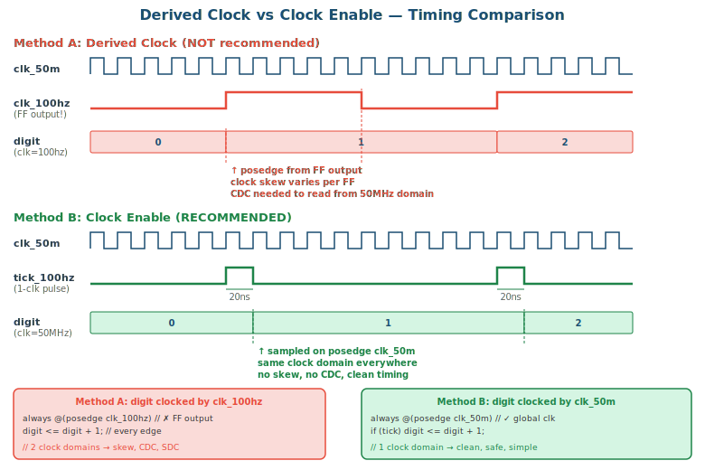

# 5주차 부록: Derived Clock vs Clock Enable

## Timing Diagram



## 문제 상황

50MHz 시스템에서 어떤 모듈을 100Hz로 동작시키려 한다. 두 가지 방법이 있다:

- **방법 A:** 50MHz를 분주하여 100Hz 클럭을 만들고, 그것을 모듈의 `clk`으로 사용
- **방법 B:** 50MHz 클럭을 그대로 사용하되, 100Hz `tick` 신호를 clock enable으로 사용

---

## 방법 A: Derived Clock (분주 클럭)

```verilog
// 50MHz → 100Hz 클럭 생성 (toggle 방식)
reg [17:0] div_cnt;
reg        clk_100hz;   // ← 이것을 다른 모듈의 clk으로 사용

always @(posedge clk_50m or negedge rst_n) begin
    if (!rst_n) begin
        div_cnt   <= 0;
        clk_100hz <= 0;
    end else if (div_cnt == 18'd249_999) begin
        div_cnt   <= 0;
        clk_100hz <= ~clk_100hz;  // toggle → 50% duty
    end else begin
        div_cnt <= div_cnt + 1;
    end
end

// 사용: clk_100hz를 모듈의 클럭으로 연결
bcd_digit d0(
    .clk(clk_100hz),     // ★ 분주된 클럭 사용
    .rst_n(rst_n),
    .tick_in(1'b1),       // 매 클럭마다 동작
    .digit(cs_lo),
    .carry(c0)
);
```

### 방법 A의 문제점

1. **Clock Skew**: `clk_100hz`는 flip-flop 출력(Q)이므로 global clock network를 타지 않는다. 이 신호가 여러 모듈의 `clk`으로 분배되면, 각 flip-flop에 도달하는 시간이 달라져 **setup/hold violation**이 발생할 수 있다.

2. **Clock Domain Crossing**: 시스템의 다른 모듈은 50MHz로 동작하므로, `clk_100hz` 도메인과 데이터를 주고받을 때 **metastability** 문제가 발생한다. 동기화 회로(2-stage synchronizer)가 추가로 필요하다.

3. **Timing Analysis 실패**: Quartus의 TimeQuest는 `clk_100hz`를 자동으로 클럭으로 인식하지 못한다. 수동으로 `create_generated_clock` SDC 제약을 추가해야 하며, 이를 빠뜨리면 타이밍 분석이 불완전해진다.

4. **Reset 동기화 문제**: `rst_n`이 50MHz에 동기화되어 있으면, `clk_100hz` 도메인에서는 비동기 리셋이 되어 release timing이 보장되지 않는다.

---

## 방법 B: Clock Enable (권장)

```verilog
// 50MHz에서 100Hz tick 생성 (1-clock pulse)
module prescaler_100hz #(
    parameter MAX = 26'd499_999
)(
    input      clk, rst_n, enable,
    output reg tick
);
    reg [25:0] cnt;

    always @(posedge clk or negedge rst_n) begin
        if (!rst_n)          begin cnt <= 0; tick <= 0; end
        else if (!enable)    begin cnt <= 0; tick <= 0; end    // disable 
        else if (cnt == MAX) begin cnt <= 0; tick <= 1; end    // tick
        else                 begin cnt <= cnt + 1; tick <= 0; end   // count up
    end
endmodule

// 사용: 50MHz clk 그대로, tick을 enable로 사용
bcd_digit d0(
    .clk(clk_50m),        // ★ 원래 50MHz 클럭 유지
    .rst_n(rst_n),
    .tick_in(tick_100hz),  // ★ clock enable 역할
    .digit(cs_lo),
    .carry(c0)
);
```

```verilog
// bcd_digit 내부: tick_in이 1일 때만 동작
always @(posedge clk or negedge rst_n) begin
    if (!rst_n)          digit <= 4'd0;
    else if (tick_in)    digit <= (digit == 4'd9) ? 4'd0 : digit + 4'd1;
    //       ^^^^^^^^ clock enable: 50MHz 중 100Hz 순간에만 값 변경
end
```

### 방법 B의 장점

1. **Single Clock Domain**: 모든 flip-flop이 동일한 50MHz 클럭을 사용하므로 clock skew 문제가 없다. Global clock network를 통해 균일하게 분배된다.

2. **No CDC Issue**: 클럭 도메인이 하나이므로 metastability 문제가 원천적으로 발생하지 않는다. 모듈 간 데이터 교환이 자유롭다.

3. **Timing Analysis 용이**: Quartus가 `CLOCK_50` 하나만 분석하면 된다. SDC 제약 추가가 불필요하다.

4. **Reset 일관성**: 모든 레지스터가 동일 클럭에 동기화되어 있으므로 비동기 리셋의 release도 일관적이다.

---

## 비교 요약

| 항목 | 방법 A (Derived Clock) | 방법 B (Clock Enable) |
|------|----------------------|----------------------|
| clk 신호 | 분주된 100Hz | 원래 50MHz |
| 동작 제어 | 매 클럭 에지마다 | `tick_in == 1`일 때만 |
| Clock Network | FF 출력 → routing | Global clock buffer |
| Clock Skew | 심각할 수 있음 | 없음 |
| Clock Domain | 2개 (50MHz + 100Hz) | 1개 (50MHz) |
| CDC 문제 | 있음 (synchronizer 필요) | 없음 |
| Timing Analysis | SDC 수동 설정 필요 | 자동, 간단 |
| 리소스 | 적음 (FF 수 적음) | 약간 더 많음 (enable 로직) |
| 합성 결과 | 예측 어려움 | 예측 가능 |
| FPGA 권장 여부 | ✗ 비권장 | ✓ 권장 |

---

## Quartus에서의 경고

방법 A를 사용하면 Quartus 합성 시 다음과 같은 Warning이 나타날 수 있다:

```
Warning: Signal "clk_100hz" is not a clock but is used as a clock
Warning: Found combinational loop involving ... 
Critical Warning: Timing requirements not met
```

이 경고가 나오면 derived clock 사용을 의심하고, clock enable 방식으로 전환해야 한다.

---

## 결론

> ⚠️ **FPGA 설계 원칙:** 클럭은 항상 보드의 oscillator에서 직접 오는 것만 사용하라. 느린 동작이 필요하면 **clock enable** 패턴을 사용하라. 분주된 신호를 `clk`으로 사용하는 것은 ASIC에서는 허용될 수 있지만, FPGA에서는 거의 항상 문제를 일으킨다.

본 강의의 모든 설계(stopwatch, vending machine, calculator, reaction timer)는 **방법 B (Clock Enable)**를 사용한다. `prescaler_100hz`가 생성하는 `tick`은 클럭이 아니라 **1-clock-wide enable pulse**이며, 모든 모듈은 50MHz `CLOCK_50`을 공유한다.
