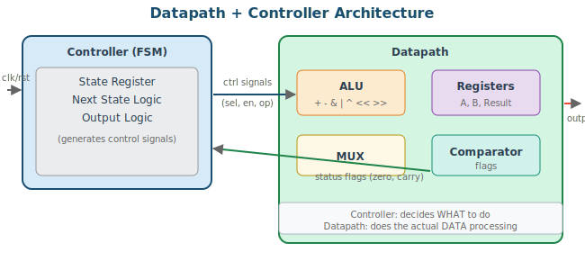
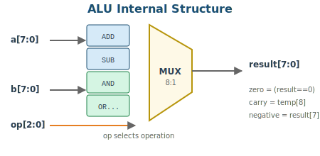
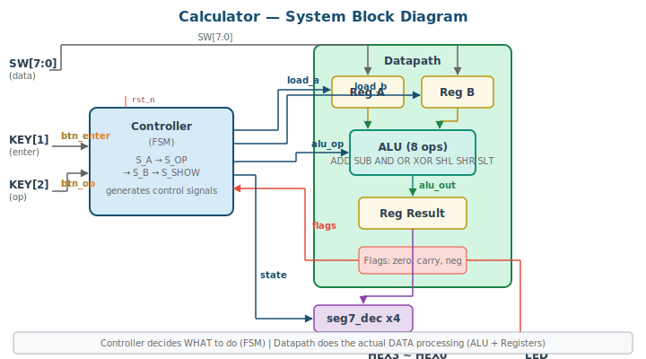

# 6주차: 데이터패스 + 제어기 설계

## 6-1. [Mon] 설계 방법론 (70min)

### 학습 목표

- 데이터패스/제어기 분리 설계 방법론을 설명할 수 있다
- ALU를 설계하고 데이터패스에 통합할 수 있다
- 계산기를 FSM 제어기 + 데이터패스로 구현할 수 있다

### 1. Datapath + Controller Separation



복잡한 디지털 시스템은 두 부분으로 분리한다:

- **Controller (FSM):** '무엇을 할지' 결정 — load, select, operation 제어 신호 생성
- **Datapath:** '실제 데이터 처리' — registers, ALU, MUX, comparator

> 💡 **TIP:** 이 분리가 6주차 핵심 개념이다. 이후 프로젝트, AI 코딩에서도 이 구조가 기준이 된다.

### 2. 8-bit ALU



```verilog
module alu_8bit(
    input  [7:0] a, b,
    input  [2:0] op,
    output reg [7:0] result,
    output       zero, carry_out, negative
);
    reg [8:0] temp;

    always @(*) begin
        temp = 9'b0;
        case(op)
            3'b000: temp = {1'b0,a} + {1'b0,b};   // ADD
            3'b001: temp = {1'b0,a} - {1'b0,b};   // SUB
            3'b010: temp = {1'b0, a & b};           // AND
            3'b011: temp = {1'b0, a | b};           // OR
            3'b100: temp = {1'b0, a ^ b};           // XOR
            3'b101: temp = {1'b0, a << 1};          // SHL
            3'b110: temp = {1'b0, a >> 1};          // SHR
            3'b111: temp = (a < b) ? 9'd1 : 9'd0;  // SLT
            default: temp = 9'b0;
        endcase
        result = temp[7:0];
    end

    assign carry_out = temp[8];
    assign zero      = (result == 8'b0);
    assign negative  = result[7];
endmodule
```

> 📝 **NOTE (수정사항):** ADD/SUB에서 `{1'b0,a}+{1'b0,b}` 형태로 9비트 확장하여 carry를 정확하게 계산한다. 이전 버전에서 `a+b`로 하면 implicit truncation이 발생할 수 있다.

### ALU Testbench

```verilog
`timescale 1ns/1ps
module alu_8bit_tb;
    reg  [7:0] a, b;
    reg  [2:0] op;
    wire [7:0] result;
    wire       zero, carry_out, negative;

    alu_8bit uut(.*);

    integer errors = 0;
    reg [8:0] expected;

    task test_alu;
        input [7:0] ta, tb;
        input [2:0] top;
        input [7:0] exp_result;
        begin
            a = ta; b = tb; op = top; #10;
            if (result !== exp_result) begin
                $display("FAIL: a=%h b=%h op=%b -> got=%h exp=%h",
                         ta, tb, top, result, exp_result);
                errors = errors + 1;
            end
        end
    endtask

    initial begin
        $display("=== ALU Test ===");
        // ADD
        test_alu(8'd100, 8'd55, 3'b000, 8'd155);
        test_alu(8'd200, 8'd100, 3'b000, 8'd44); // overflow: 300-256=44
        // SUB
        test_alu(8'd100, 8'd55, 3'b001, 8'd45);
        test_alu(8'd10,  8'd20, 3'b001, 8'd246); // underflow: -10 = 246
        // AND
        test_alu(8'hAA, 8'h55, 3'b010, 8'h00);
        test_alu(8'hFF, 8'h0F, 3'b010, 8'h0F);
        // OR
        test_alu(8'hAA, 8'h55, 3'b011, 8'hFF);
        // XOR
        test_alu(8'hAA, 8'hFF, 3'b100, 8'h55);
        // SHL
        test_alu(8'h81, 8'h00, 3'b101, 8'h02);
        // SHR
        test_alu(8'h81, 8'h00, 3'b110, 8'h40);
        // SLT
        test_alu(8'd10, 8'd20, 3'b111, 8'd1);
        test_alu(8'd20, 8'd10, 3'b111, 8'd0);

        // Check flags
        a = 8'd0; b = 8'd0; op = 3'b000; #10;
        if (!zero) begin $display("FAIL: zero flag"); errors = errors+1; end

        $display("=== Done: %0d errors ===", errors);
        $finish;
    end
endmodule
```

### 3. Calculator System



```verilog
module calculator(
    input        clk, rst_n,
    input  [7:0] sw_data,     // switch data input
    input        btn_enter,    // enter button (debounced)
    input        btn_op,       // change operator (debounced)
    output [6:0] HEX0, HEX1, HEX2, HEX3,
    output [2:0] alu_flags     // {negative, carry, zero}
);
    // --- Datapath ---
    reg  [7:0] reg_a, reg_b;
    reg  [2:0] alu_op;
    wire [7:0] alu_out;
    wire       alu_zero, alu_carry, alu_neg;

    alu_8bit u_alu(
        .a(reg_a), .b(reg_b), .op(alu_op),
        .result(alu_out), .zero(alu_zero),
        .carry_out(alu_carry), .negative(alu_neg)
    );

    // --- Controller FSM ---
    localparam S_A=2'd0, S_OP=2'd1, S_B=2'd2, S_SHOW=2'd3;
    reg [1:0] state, next_state;
    reg [7:0] reg_result;

    // P1
    always @(posedge clk or negedge rst_n)
        if (!rst_n) state <= S_A;
        else        state <= next_state;

    // P2
    always @(*) begin
        next_state = state;
        case(state)
            S_A:    if (btn_enter) next_state = S_OP;
            S_OP:   if (btn_enter) next_state = S_B;
            S_B:    if (btn_enter) next_state = S_SHOW;
            S_SHOW: if (btn_enter) next_state = S_A;
        endcase
    end

    // Datapath control
    always @(posedge clk or negedge rst_n) begin
        if (!rst_n) begin
            reg_a <= 0; reg_b <= 0; alu_op <= 0; reg_result <= 0;
        end else case(state)
            S_A:    if (btn_enter) reg_a <= sw_data;
            S_OP:   if (btn_op) alu_op <= (alu_op == 3'd7) ? 3'd0 : alu_op + 1;
            S_B:    if (btn_enter) reg_b <= sw_data;
            S_SHOW: reg_result <= alu_out;  // ★ latch result in SHOW state
        endcase
    end

    // Display
    reg [3:0] dh3, dh2, dh1, dh0;
    always @(*) begin
        case(state)
            S_A:    {dh3,dh2,dh1,dh0} = {4'hA, 4'h0, sw_data[7:4], sw_data[3:0]};
            S_OP:   {dh3,dh2,dh1,dh0} = {4'h0, {1'b0,alu_op}, reg_a[7:4], reg_a[3:0]};
            S_B:    {dh3,dh2,dh1,dh0} = {4'hB, 4'h0, sw_data[7:4], sw_data[3:0]};
            S_SHOW: {dh3,dh2,dh1,dh0} = {4'hE, 4'h0, reg_result[7:4], reg_result[3:0]};
            default:{dh3,dh2,dh1,dh0} = 16'h0;
        endcase
    end

    seg7_decoder sh3(.hex(dh3), .seg(HEX3));
    seg7_decoder sh2(.hex(dh2), .seg(HEX2));
    seg7_decoder sh1(.hex(dh1), .seg(HEX1));
    seg7_decoder sh0(.hex(dh0), .seg(HEX0));

    assign alu_flags = {alu_neg, alu_carry, alu_zero};
endmodule
```

> ⚠️ **WARNING (수정사항):** 이전 버전에서는 S_B 상태에서 `reg_b`와 `reg_result`를 동시에 할당했다. 이 경우 `alu_out`은 아직 이전 `reg_b` 기반이므로 결과가 틀린다. 수정 버전에서는 S_B에서 `reg_b`만 저장하고, S_SHOW에서 `reg_result <= alu_out`으로 래치하여 정확한 결과를 얻는다.

### Hex-to-BCD Conversion (과제 힌트)

과제에서 10진수 표시를 요구하므로, hex-to-BCD 변환 방법을 소개한다:

```verilog
// Simple hex-to-BCD for 0~255 (shift-add-3 / double-dabble)
module hex2bcd(
    input  [7:0] hex,
    output [3:0] hundreds, tens, ones
);
    integer i;
    reg [19:0] bcd;  // {hundreds, tens, ones, hex} working register

    always @(*) begin
        bcd = 20'b0;
        bcd[7:0] = hex;
        for (i = 0; i < 8; i = i + 1) begin
            // Add 3 to any BCD digit >= 5 before shifting
            if (bcd[11:8]  >= 5) bcd[11:8]  = bcd[11:8]  + 3;
            if (bcd[15:12] >= 5) bcd[15:12] = bcd[15:12] + 3;
            if (bcd[19:16] >= 5) bcd[19:16] = bcd[19:16] + 3;
            bcd = bcd << 1;
        end
    end

    assign hundreds = bcd[19:16];
    assign tens     = bcd[15:12];
    assign ones     = bcd[11:8];
endmodule
```

---

## 6-2. [Wed] Lab: Calculator Implementation (70min)

### 실습 순서

1. `alu_8bit` 코딩 → TB로 8개 연산 전수 검증
2. `calculator` Top 작성 → FSM 동작 시뮬레이션
3. 보드에서 실제 계산 시연

### 6주차 과제

**과제 6-1 (필수): Calculator Enhancement**
- 연산자를 HEX3에 문자로 표시 (A=Add, 5=Sub, n=aNd, etc.)
- 결과를 10진수로 HEX에 표시 (`hex2bcd` 활용)
- 음수 결과 시 '-' 표시 + 절대값 (HEX3에 '-' 패턴: 7'b0111111)

**과제 6-2 (가산점): History Feature**
- 최근 4개 연산 결과를 register array에 저장
- KEY로 순환 표시

---
---
