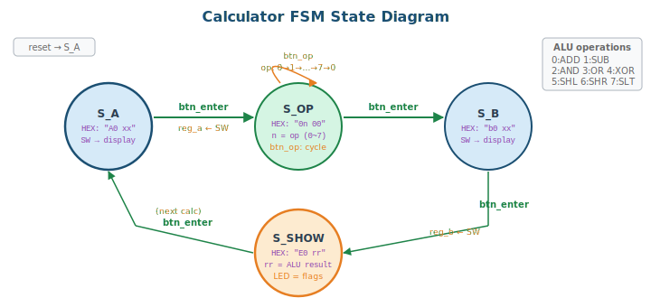

# 6주차: 데이터패스 + 제어기 설계

## 6-1. [Mon] 설계 방법론 (70min)

### 학습 목표

- 데이터패스/제어기 분리 설계 방법론을 설명할 수 있다
- ALU를 설계하고 데이터패스에 통합할 수 있다
- 계산기를 FSM 제어기 + 데이터패스로 구현할 수 있다

### 1. Datapath + Controller Separation


#### 왜 분리하는가?

4~5주차에서 만든 FSM(자판기, 스톱워치)은 상태가 늘어날수록 코드가 복잡해진다. 특히 **데이터 처리**(덧셈, 비교, 저장)와 **제어 흐름**(언제 더하고, 언제 저장하고, 언제 표시할지)이 하나의 코드에 뒤섞이면 디버깅이 매우 어려워진다.

해결책은 시스템을 **두 부분**으로 나누는 것이다:

#### Controller (제어기) — "무엇을 할지" 결정

Controller는 FSM으로 구현되며, 현재 상태와 입력/상태 플래그를 보고 **제어 신호**를 생성한다. Controller는 데이터 자체를 처리하지 않는다. 오직 Datapath에게 "지금 이것을 하라"는 명령만 내린다.

Controller가 생성하는 제어 신호의 예:
- `load_a`: "레지스터 A에 현재 SW 값을 저장하라"
- `load_b`: "레지스터 B에 현재 SW 값을 저장하라"
- `alu_op[2:0]`: "ALU에서 이 연산을 수행하라" (ADD, SUB, AND, ...)
- `sel_display`: "HEX에 어떤 값을 표시할지 선택하라"

Controller가 Datapath로부터 받는 상태 신호의 예:
- `zero`: "연산 결과가 0이다"
- `carry`: "자리올림이 발생했다"
- `negative`: "결과가 음수이다"

#### Datapath (데이터패스) — "실제 데이터 처리"

Datapath는 데이터를 저장하고, 연산하고, 이동시키는 하드웨어 블록들의 집합이다. 스스로 언제 동작할지 결정하지 않고, Controller의 제어 신호에 따라 동작한다.

Datapath 내부의 주요 블록:
- **Register (레지스터)**: 데이터를 저장하는 flip-flop 배열. 예: reg_a(피연산자 A), reg_b(피연산자 B), reg_result(결과)
- **ALU (산술논리연산기)**: 두 입력에 대해 산술(+, -)과 논리(&, |, ^) 연산을 수행. `op` 신호에 따라 연산 종류가 결정됨
- **MUX (멀티플렉서)**: 여러 데이터 중 하나를 선택. 예: HEX 표시 데이터를 상태에 따라 전환
- **Comparator (비교기)**: 연산 결과의 상태를 판단하여 zero, carry, negative 플래그 생성. 이 플래그는 Controller로 피드백됨

#### 분리 설계의 장점

1. **모듈별 독립 검증**: ALU만 따로 TB를 만들어 8개 연산을 전수 검증한 후, Calculator에 통합할 수 있다
2. **재사용**: 같은 ALU를 다른 프로젝트(CPU, DSP 등)에 그대로 재사용 가능
3. **디버깅 용이**: 결과가 틀릴 때 "Controller 문제인가, Datapath 문제인가"를 분리하여 추적 가능
4. **확장 용이**: 연산을 추가하려면 ALU의 case문만 확장하면 되고, Controller는 op 코드만 추가

> 💡 **TIP:** 이 분리가 6주차 핵심 개념이다. 이후 프로젝트, AI 코딩에서도 이 구조가 기준이 된다. 실제 CPU도 이 구조(Control Unit + Datapath)로 설계된다.

### 2. 8-bit ALU


```verilog
module alu_8bit(
    input  [7:0] a, b,
    input  [2:0] op,
    output reg [7:0] result,
    output       zero, carry_out, negative
);
    reg [8:0] temp;

    always @(*) begin
        temp = 9'b0;
        case(op)
            3'b000: temp = {1'b0,a} + {1'b0,b};   // ADD
            3'b001: temp = {1'b0,a} - {1'b0,b};   // SUB
            3'b010: temp = {1'b0, a & b};           // AND
            3'b011: temp = {1'b0, a | b};           // OR
            3'b100: temp = {1'b0, a ^ b};           // XOR
            3'b101: temp = {a, 1'b0};              // SHL (MSB→carry)
            3'b110: temp = {1'b0, a >> 1};          // SHR
            3'b111: temp = (a < b) ? 9'd1 : 9'd0;  // SLT
            default: temp = 9'b0;
        endcase
        result = temp[7:0];
    end

    assign carry_out = temp[8];
    assign zero      = (result == 8'b0);
    assign negative  = result[7];
endmodule
```

> 📝 **NOTE (수정사항):** ADD/SUB에서 `{1'b0,a}+{1'b0,b}` 형태로 9비트 확장하여 carry를 정확하게 계산한다. 이전 버전에서 `a+b`로 하면 implicit truncation이 발생할 수 있다.

### ALU Testbench

```verilog
`timescale 1ns/1ps
module alu_8bit_tb;
    reg  [7:0] a, b;
    reg  [2:0] op;
    wire [7:0] result;
    wire       zero, carry_out, negative;

    alu_8bit uut(.*);

    integer errors = 0;

    task test_alu;
        input [7:0] ta, tb;
        input [2:0] top;
        input [7:0] exp_result;
        input       exp_carry, exp_zero, exp_neg;
        input [63:0] desc;   // test description (8 chars)
        begin
            a = ta; b = tb; op = top; #10;
            if (result !== exp_result || carry_out !== exp_carry ||
                zero !== exp_zero || negative !== exp_neg) begin
                $display("FAIL [%0s]: a=%h b=%h op=%b -> result=%h(exp %h) C=%b(exp %b) Z=%b(exp %b) N=%b(exp %b)",
                         desc, ta, tb, top,
                         result, exp_result,
                         carry_out, exp_carry,
                         zero, exp_zero,
                         negative, exp_neg);
                errors = errors + 1;
            end else begin
                $display("PASS [%0s]: a=%h b=%h op=%b -> result=%h  C=%b Z=%b N=%b",
                         desc, ta, tb, top, result,
                         carry_out, zero, negative);
            end
        end
    endtask

    initial begin
        $display("=== ALU 8-bit Testbench ===");

        // ---- ADD (op=000) ----
        //                  a       b      op     result  C  Z  N  description
        test_alu(8'd100, 8'd55,  3'b000, 8'd155, 0, 0, 1, "ADD norm");
        // 100+55=155. carry=0, zero=0, neg=1 (result[7]=1, 155=0x9B)

        test_alu(8'd200, 8'd100, 3'b000, 8'd44,  1, 0, 0, "ADD ovfl");
        // 200+100=300, 300-256=44. carry=1 (overflow), result=44

        test_alu(8'd0,   8'd0,   3'b000, 8'd0,   0, 1, 0, "ADD zero");
        // 0+0=0. zero=1

        // ---- SUB (op=001) ----
        test_alu(8'd100, 8'd55,  3'b001, 8'd45,  0, 0, 0, "SUB norm");
        // 100-55=45. no borrow, positive

        test_alu(8'd10,  8'd20,  3'b001, 8'd246, 1, 0, 1, "SUB undfl");
        // 10-20=-10. borrow(carry=1), result=246(0xF6), neg=1

        test_alu(8'd50,  8'd50,  3'b001, 8'd0,   0, 1, 0, "SUB eq  ");
        // 50-50=0. zero=1

        // ---- AND (op=010) ----
        test_alu(8'hAA,  8'h55,  3'b010, 8'h00,  0, 1, 0, "AND comp");
        // 0xAA & 0x55 = 0x00. complementary bits, zero=1

        test_alu(8'hFF,  8'h0F,  3'b010, 8'h0F,  0, 0, 0, "AND mask");
        // 0xFF & 0x0F = 0x0F. mask lower nibble

        // ---- OR (op=011) ----
        test_alu(8'hAA,  8'h55,  3'b011, 8'hFF,  0, 0, 1, "OR  fill");
        // 0xAA | 0x55 = 0xFF. neg=1 (bit7=1)

        test_alu(8'h00,  8'h00,  3'b011, 8'h00,  0, 1, 0, "OR  zero");
        // 0x00 | 0x00 = 0x00. zero=1

        // ---- XOR (op=100) ----
        test_alu(8'hAA,  8'hFF,  3'b100, 8'h55,  0, 0, 0, "XOR inv ");
        // 0xAA ^ 0xFF = 0x55. bit inversion

        test_alu(8'hAA,  8'hAA,  3'b100, 8'h00,  0, 1, 0, "XOR same");
        // 0xAA ^ 0xAA = 0x00. same value → zero=1

        // ---- SHL (op=101) ----
        test_alu(8'h81,  8'h00,  3'b101, 8'h02,  1, 0, 0, "SHL crry");
        // 0x81=1000_0001, <<1 = 0000_0010. MSB(1)→carry=1

        test_alu(8'h40,  8'h00,  3'b101, 8'h80,  0, 0, 1, "SHL neg ");
        // 0x40=0100_0000, <<1 = 1000_0000. carry=0, neg=1

        // ---- SHR (op=110) ----
        test_alu(8'h81,  8'h00,  3'b110, 8'h40,  0, 0, 0, "SHR norm");
        // 0x81=1000_0001, >>1 = 0100_0000. logical shift

        test_alu(8'h01,  8'h00,  3'b110, 8'h00,  0, 1, 0, "SHR zero");
        // 0x01 >>1 = 0x00. zero=1

        // ---- SLT (op=111) ----
        test_alu(8'd10,  8'd20,  3'b111, 8'd1,   0, 0, 0, "SLT lt  ");
        // 10 < 20 → true(1)

        test_alu(8'd20,  8'd10,  3'b111, 8'd0,   0, 1, 0, "SLT gt  ");
        // 20 < 10 → false(0), zero=1

        test_alu(8'd10,  8'd10,  3'b111, 8'd0,   0, 1, 0, "SLT eq  ");
        // 10 < 10 → false(0), zero=1

        $display("=== Done: %0d errors ===", errors);
        if (errors == 0) $display("*** ALL 21 TESTS PASSED ***");
        $finish;
    end
endmodule
```

> 📝 **테스트 항목 설명 (21개):**
>
> | # | 연산 | 테스트 내용 | 검증 포인트 |
> |---|------|------------|------------|
> | 1 | ADD | 100+55=155 | 정상 덧셈, neg=1 (155>127) |
> | 2 | ADD | 200+100=300→44 | carry=1 (8비트 오버플로) |
> | 3 | ADD | 0+0=0 | zero=1 플래그 |
> | 4 | SUB | 100-55=45 | 정상 뺄셈 |
> | 5 | SUB | 10-20=246 | carry=1 (borrow), neg=1 |
> | 6 | SUB | 50-50=0 | zero=1 플래그 |
> | 7 | AND | 0xAA&0x55=0x00 | 상보 비트 → zero=1 |
> | 8 | AND | 0xFF&0x0F=0x0F | 마스크 연산 |
> | 9 | OR | 0xAA\|0x55=0xFF | 비트 채움, neg=1 |
> | 10 | OR | 0x00\|0x00=0x00 | zero=1 플래그 |
> | 11 | XOR | 0xAA^0xFF=0x55 | 비트 반전 |
> | 12 | XOR | 0xAA^0xAA=0x00 | 동일 값 → zero=1 |
> | 13 | SHL | 0x81<<1=0x02 | MSB→carry=1 (carry 검증) |
> | 14 | SHL | 0x40<<1=0x80 | carry=0, neg=1 |
> | 15 | SHR | 0x81>>1=0x40 | 논리 우측 시프트 |
> | 16 | SHR | 0x01>>1=0x00 | zero=1 플래그 |
> | 17 | SLT | 10<20 → 1 | 작으면 1 |
> | 18 | SLT | 20<10 → 0 | 크면 0 |
> | 19 | SLT | 10<10 → 0 | 같으면 0, zero=1 |

### 3. Calculator System


#### FSM State Transition



동작 순서:
1. **S_A** — SW[7:0]으로 A값 설정, HEX에 "A0 xx" 표시. btn_enter → reg_a에 저장
2. **S_OP** — btn_op으로 연산자 순환 (0:ADD~7:SLT), HEX에 "0n 00" 표시. btn_enter → 확정
3. **S_B** — SW[7:0]으로 B값 설정, HEX에 "b0 xx" 표시. btn_enter → reg_b에 저장
4. **S_SHOW** — ALU 결과를 HEX에 "E0 rr" 표시, LED에 flags. btn_enter → S_A로 복귀

```verilog
module calculator(
    input        clk, rst_n,
    input  [7:0] sw_data,     // switch data input
    input        btn_enter,    // enter button (debounced)
    input        btn_op,       // change operator (debounced)
    output [6:0] HEX0, HEX1, HEX2, HEX3,
    output [2:0] alu_flags     // {negative, carry, zero}
);
    // --- Datapath ---
    reg  [7:0] reg_a, reg_b;
    reg  [2:0] alu_op;
    wire [7:0] alu_out;
    wire       alu_zero, alu_carry, alu_neg;

    alu_8bit u_alu(
        .a(reg_a), .b(reg_b), .op(alu_op),
        .result(alu_out), .zero(alu_zero),
        .carry_out(alu_carry), .negative(alu_neg)
    );

    // --- Controller FSM ---
    localparam S_A=2'd0, S_OP=2'd1, S_B=2'd2, S_SHOW=2'd3;
    reg [1:0] state, next_state;
    reg [7:0] reg_result;

    // P1
    always @(posedge clk or negedge rst_n)
        if (!rst_n) state <= S_A;
        else        state <= next_state;

    // P2
    always @(*) begin
        next_state = state;
        case(state)
            S_A:    if (btn_enter) next_state = S_OP;
            S_OP:   if (btn_enter) next_state = S_B;
            S_B:    if (btn_enter) next_state = S_SHOW;
            S_SHOW: if (btn_enter) next_state = S_A;
        endcase
    end

    // Datapath control
    always @(posedge clk or negedge rst_n) begin
        if (!rst_n) begin
            reg_a <= 0; reg_b <= 0; alu_op <= 0; reg_result <= 0;
        end else case(state)
            S_A:    if (btn_enter) reg_a <= sw_data;
            S_OP:   if (btn_op) alu_op <= (alu_op == 3'd7) ? 3'd0 : alu_op + 1;
            S_B:    if (btn_enter) reg_b <= sw_data;
            S_SHOW: reg_result <= alu_out;  // ★ latch result in SHOW state
        endcase
    end

    // Display
    reg [3:0] dh3, dh2, dh1, dh0;
    always @(*) begin
        case(state)
            S_A:    {dh3,dh2,dh1,dh0} = {4'hA, 4'h0, sw_data[7:4], sw_data[3:0]};
            S_OP:   {dh3,dh2,dh1,dh0} = {4'h0, {1'b0,alu_op}, 4'h0, 4'h0};
            S_B:    {dh3,dh2,dh1,dh0} = {4'hB, 4'h0, sw_data[7:4], sw_data[3:0]};
            S_SHOW: {dh3,dh2,dh1,dh0} = {4'hE, 4'h0, reg_result[7:4], reg_result[3:0]};
            default:{dh3,dh2,dh1,dh0} = 16'h0;
        endcase
    end

    seg7_decoder sh3(.hex(dh3), .seg(HEX3));
    seg7_decoder sh2(.hex(dh2), .seg(HEX2));
    seg7_decoder sh1(.hex(dh1), .seg(HEX1));
    seg7_decoder sh0(.hex(dh0), .seg(HEX0));

    assign alu_flags = {alu_neg, alu_carry, alu_zero};
endmodule
```

> ⚠️ **WARNING (수정사항):** 이전 버전에서는 S_B 상태에서 `reg_b`와 `reg_result`를 동시에 할당했다. 이 경우 `alu_out`은 아직 이전 `reg_b` 기반이므로 결과가 틀린다. 수정 버전에서는 S_B에서 `reg_b`만 저장하고, S_SHOW에서 `reg_result <= alu_out`으로 래치하여 정확한 결과를 얻는다.

### Calculator Board Top Modules

**DE0 version:**
```verilog
module calculator_de0(
    input        CLOCK_50,
    input  [7:0] SW,           // SW[7:0] = data input
    input  [2:0] KEY,          // KEY[0]=rst, KEY[1]=enter, KEY[2]=op
    output [7:0] LEDG,         // LEDG[2:0] = flags {neg,carry,zero}
    output [6:0] HEX0, HEX1, HEX2, HEX3
);
    wire btn_enter, btn_op;

    btn_debounce #(.DEBOUNCE_CNT(999_999)) u_db1(
        .clk(CLOCK_50), .rst_n(KEY[0]),
        .btn_raw(KEY[1]), .btn_pulse(btn_enter)
    );
    btn_debounce #(.DEBOUNCE_CNT(999_999)) u_db2(
        .clk(CLOCK_50), .rst_n(KEY[0]),
        .btn_raw(KEY[2]), .btn_pulse(btn_op)
    );

    wire [2:0] flags;

    calculator u_calc(
        .clk(CLOCK_50), .rst_n(KEY[0]),
        .sw_data(SW[7:0]),
        .btn_enter(btn_enter), .btn_op(btn_op),
        .HEX0(HEX0), .HEX1(HEX1), .HEX2(HEX2), .HEX3(HEX3),
        .alu_flags(flags)
    );

    assign LEDG[2:0] = flags;   // {negative, carry, zero}
    assign LEDG[7:3] = 5'b0;
endmodule
```

**DE1 version:**
```verilog
module calculator_de1(
    input         CLOCK_50,
    input   [9:0] SW,          // SW[7:0] = data input
    input   [3:0] KEY,         // KEY[0]=rst, KEY[1]=enter, KEY[2]=op
    output  [9:0] LEDR,        // LEDR[2:0] = flags
    output  [7:0] LEDG,
    output  [6:0] HEX0, HEX1, HEX2, HEX3
);
    wire btn_enter, btn_op;

    btn_debounce #(.DEBOUNCE_CNT(999_999)) u_db1(
        .clk(CLOCK_50), .rst_n(KEY[0]),
        .btn_raw(KEY[1]), .btn_pulse(btn_enter)
    );
    btn_debounce #(.DEBOUNCE_CNT(999_999)) u_db2(
        .clk(CLOCK_50), .rst_n(KEY[0]),
        .btn_raw(KEY[2]), .btn_pulse(btn_op)
    );

    wire [2:0] flags;

    calculator u_calc(
        .clk(CLOCK_50), .rst_n(KEY[0]),
        .sw_data(SW[7:0]),
        .btn_enter(btn_enter), .btn_op(btn_op),
        .HEX0(HEX0), .HEX1(HEX1), .HEX2(HEX2), .HEX3(HEX3),
        .alu_flags(flags)
    );

    assign LEDR[2:0] = flags;
    assign LEDR[9:3] = 7'b0;
    assign LEDG       = 8'b0;
endmodule
```

### Hex-to-BCD Conversion (과제 힌트)

과제에서 10진수 표시를 요구하므로, hex-to-BCD 변환 방법을 소개한다:

```verilog
// Simple hex-to-BCD for 0~255 (shift-add-3 / double-dabble)
module hex2bcd(
    input  [7:0] hex,
    output [3:0] hundreds, tens, ones
);
    integer i;
    reg [19:0] bcd;  // {hundreds, tens, ones, hex} working register

    always @(*) begin
        bcd = 20'b0;
        bcd[7:0] = hex;
        for (i = 0; i < 8; i = i + 1) begin
            // Add 3 to any BCD digit >= 5 before shifting
            if (bcd[11:8]  >= 5) bcd[11:8]  = bcd[11:8]  + 3;
            if (bcd[15:12] >= 5) bcd[15:12] = bcd[15:12] + 3;
            if (bcd[19:16] >= 5) bcd[19:16] = bcd[19:16] + 3;
            bcd = bcd << 1;
        end
    end

    assign hundreds = bcd[19:16];
    assign tens     = bcd[15:12];
    assign ones     = bcd[11:8];
endmodule
```

---

## 6-2. [Wed] Lab: Calculator Implementation (70min)

### 실습 순서

1. `alu_8bit` 코딩 → TB로 8개 연산 전수 검증
2. `calculator` Top 작성 → FSM 동작 시뮬레이션
3. 보드에서 실제 계산 시연

### 6주차 과제

**과제 6-1 (필수): Calculator Enhancement**
- 연산자를 HEX3에 문자로 표시 (A=Add, 5=Sub, n=aNd, etc.)
- 결과를 10진수로 HEX에 표시 (`hex2bcd` 활용)
- 음수 결과 시 '-' 표시 + 절대값 (HEX3에 '-' 패턴: 7'b0111111)

**과제 6-2 (가산점): History Feature**
- 최근 4개 연산 결과를 register array에 저장
- KEY로 순환 표시

---
---
