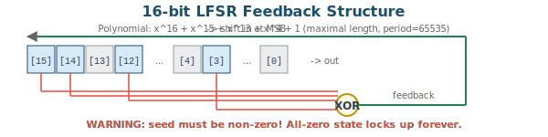
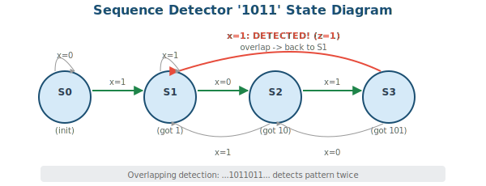
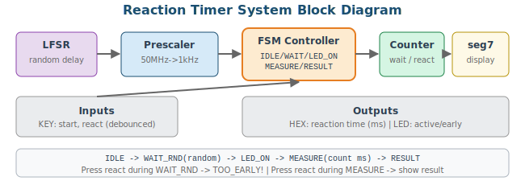

# 7주차: 종합 설계 연습 및 중간고사 대비

## 7-1. [Mon] 종합 설계 예제 (70min)

### 학습 목표

- 지금까지 배운 모든 기법(FSM, datapath, prescaler, 7-seg)을 조합하여 시스템을 설계할 수 있다
- LFSR을 이용한 의사 난수 생성을 이해한다
- 시퀀스 감지기 FSM을 설계할 수 있다

### 1. LFSR (Linear Feedback Shift Register)

LFSR은 하드웨어에서 의사 난수를 생성하는 가장 효율적인 방법이다.



```verilog
// 16-bit Maximal-length LFSR
// Polynomial: x^16 + x^15 + x^13 + x^4 + 1 (verified maximal)
// Taps: bits [15], [14], [12], [3]
// Period: 2^16 - 1 = 65,535
module lfsr_16(
    input            clk, rst_n, enable,
    input     [15:0] seed,
    input            load,
    output reg [15:0] lfsr_out
);
    wire feedback = lfsr_out[15] ^ lfsr_out[14]
                  ^ lfsr_out[12] ^ lfsr_out[3];

    always @(posedge clk or negedge rst_n) begin
        if (!rst_n)       lfsr_out <= 16'hACE1; // non-zero default seed
        else if (load)    lfsr_out <= (seed == 16'h0) ? 16'hACE1 : seed;
        else if (enable)  lfsr_out <= {lfsr_out[14:0], feedback};
    end
endmodule
```

> ⚠️ **WARNING (수정사항):** 이전 버전의 다항식 `x^16+x^14+x^13+x^11+1` (탭 [15],[13],[12],[10])은 maximal-length가 검증되지 않았다. 수정 버전에서는 표준 검증된 다항식 `x^16+x^15+x^13+x^4+1` (탭 [15],[14],[12],[3])을 사용한다. 또한 `load` 시 seed가 0이면 기본 시드로 대체하여 all-zero lock-up을 방지한다.

> 📝 **NOTE:** LFSR의 값이 0이면 feedback도 0이 되어 영원히 0으로 남는다. 리셋/로드 값은 반드시 **0이 아닌 값**이어야 한다!

### 2. Sequence Detector ('1011')



```verilog
module seq_detector_1011(
    input      clk, rst_n,
    input      x,         // serial input
    output reg detected   // 1-clk pulse when '1011' found
);
    localparam S0=3'd0, S1=3'd1, S2=3'd2, S3=3'd3;
    reg [2:0] state, next_state;

    // P1
    always @(posedge clk or negedge rst_n)
        if (!rst_n) state <= S0;
        else        state <= next_state;

    // P2
    always @(*) begin
        next_state = state;  // ★ default: HOLD current state
        case (state)
            S0: next_state = x ? S1 : S0;  // waiting for first '1'
            S1: next_state = x ? S1 : S2;  // got '1', wait for '0'
            S2: next_state = x ? S3 : S0;  // got '10', wait for '1'
            S3: next_state = x ? S1 : S2;  // got '101':
                // if x=1: '1011' detected! overlap -> S1
                // if x=0: '1010' -> reuse '0' -> S2
            default: next_state = S0;
        endcase
    end

    // P3: Mealy output — detect at S3 when x=1
    always @(posedge clk or negedge rst_n)
        if (!rst_n) detected <= 0;
        else        detected <= (state == S3) && x;
endmodule
```

> 📝 **NOTE (수정사항):** 이전 버전에서 P2의 기본값이 `next_state = S0`(하드코딩)이었다. 이는 다른 모든 FSM 예제에서 사용한 `next_state = state` 패턴과 일관성이 없었다. 시퀀스 감지기에서는 각 case에서 모든 경로가 명시적으로 지정되므로 기능적 차이는 없지만, **코딩 스타일 일관성**을 위해 `next_state = state`로 통일했다.

### Sequence Detector Testbench

```verilog
`timescale 1ns/1ps
module seq_detector_tb;
    reg  clk, rst_n, x;
    wire detected;

    seq_detector_1011 uut(.*);
    initial clk = 0;
    always #10 clk = ~clk;

    integer detect_count;

    // Task: feed a bit sequence and count detections
    task feed_sequence;
        input [31:0] seq;    // bit sequence (MSB first)
        input integer len;
        integer i;
        begin
            detect_count = 0;
            for (i = len-1; i >= 0; i = i - 1) begin
                x = seq[i];
                @(posedge clk); #1;
                if (detected) detect_count = detect_count + 1;
            end
        end
    endtask

    integer errors = 0;

    initial begin
        rst_n = 0; x = 0;
        repeat(3) @(posedge clk); rst_n = 1;

        // Test 1: '1011' -> should detect once
        feed_sequence(32'b1011, 4);
        @(posedge clk); #1; // extra cycle for last detection
        if (detected) detect_count = detect_count + 1;
        if (detect_count !== 1) begin
            $display("FAIL test1: expected 1, got %0d", detect_count);
            errors = errors + 1;
        end

        // Reset
        rst_n = 0; repeat(2) @(posedge clk); rst_n = 1;

        // Test 2: '110110111011' -> should detect 2 (overlapping)
        //  Position:  1 1 0 1 1 0 1 1 1 0 1 1
        //                      ^           ^  (two '1011' patterns)
        feed_sequence(32'b110110111011, 12);
        @(posedge clk); #1;
        if (detected) detect_count = detect_count + 1;
        if (detect_count !== 2) begin
            $display("FAIL test2: expected 2, got %0d", detect_count);
            errors = errors + 1;
        end

        $display("Seq detector: %0d errors", errors);
        $finish;
    end

    initial begin $dumpfile("seq_det.vcd"); $dumpvars(0, seq_detector_tb); end
endmodule
```

### 3. Reaction Timer (Comprehensive Design)

이 설계는 LFSR + FSM + Prescaler + 7-seg를 모두 조합한 종합 예제이다.



```verilog
module reaction_timer(
    input        clk, rst_n,
    input        btn_start,    // debounced
    input        btn_react,    // debounced
    output [6:0] HEX0, HEX1, HEX2, HEX3,
    output       led_active,   // LED on during MEASURE
    output       led_early     // LED on if too early
);
    localparam IDLE=3'd0, WAIT_RND=3'd1, LED_ON=3'd2,
               MEASURE=3'd3, RESULT=3'd4, TOO_EARLY=3'd5;

    reg [2:0] state, next_state;

    // LFSR for random delay
    wire [15:0] rnd;
    lfsr_16 u_lfsr(.clk(clk),.rst_n(rst_n),
                   .enable(1'b1),.load(1'b0),.seed(16'h0),.lfsr_out(rnd));

    // 1ms prescaler
    reg [15:0] ms_cnt;
    wire ms_tick = (ms_cnt == 16'd49_999);
    always @(posedge clk or negedge rst_n)
        if (!rst_n)  ms_cnt <= 0;
        else         ms_cnt <= ms_tick ? 0 : ms_cnt + 1;

    // Random wait counter (in ms)
    reg [15:0] wait_cnt;
    wire [9:0] wait_target = rnd[9:0] + 10'd500; // 500~1523 ms

    // Reaction time counter (in ms)
    reg [15:0] reaction_ms;

    // P1
    always @(posedge clk or negedge rst_n)
        if (!rst_n) state <= IDLE;
        else        state <= next_state;

    // P2
    always @(*) begin
        next_state = state;
        case(state)
            IDLE:      if (btn_start)                  next_state = WAIT_RND;
            WAIT_RND:  if (btn_react)                  next_state = TOO_EARLY;
                       else if (wait_cnt >= wait_target) next_state = LED_ON;
            LED_ON:                                    next_state = MEASURE;
            MEASURE:   if (btn_react)                  next_state = RESULT;
            RESULT:    if (btn_start)                  next_state = IDLE;
            TOO_EARLY: if (btn_start)                  next_state = IDLE;
            default:                                   next_state = IDLE;
        endcase
    end

    // Counter logic (hint for students)
    always @(posedge clk or negedge rst_n) begin
        if (!rst_n) begin
            wait_cnt    <= 0;
            reaction_ms <= 0;
        end else begin
            case(state)
                IDLE: begin
                    wait_cnt    <= 0;
                    reaction_ms <= 0;
                end
                WAIT_RND: begin
                    if (ms_tick) wait_cnt <= wait_cnt + 1;
                end
                MEASURE: begin
                    if (ms_tick) reaction_ms <= reaction_ms + 1;
                end
                // RESULT, TOO_EARLY: hold values for display
            endcase
        end
    end

    // Output
    assign led_active = (state == LED_ON) || (state == MEASURE);
    assign led_early  = (state == TOO_EARLY);

    // Display reaction_ms on HEX (hex mode for simplicity)
    wire [15:0] display_val = (state == TOO_EARLY) ? 16'hEEEE : reaction_ms;
    seg7_decoder u_h0(.hex(display_val[3:0]),  .seg(HEX0));
    seg7_decoder u_h1(.hex(display_val[7:4]),  .seg(HEX1));
    seg7_decoder u_h2(.hex(display_val[11:8]), .seg(HEX2));
    seg7_decoder u_h3(.hex(display_val[15:12]),.seg(HEX3));
endmodule
```

> 📝 **NOTE (보강):** 이전 버전에서 `wait_cnt`와 `reaction_ms` 카운터 로직이 미완성이었다. 수정 버전에서는 완전한 카운터 로직을 제공하여 학생이 바로 시뮬레이션하고 이해할 수 있도록 했다. 과제에서는 BCD 변환을 추가하여 10진수 ms 단위로 표시하도록 한다.

---

## 7-2. [Wed] 중간고사 리뷰 (70min)

### 중간고사 범위 정리

| 주차 | 범위 |
|------|------|
| W1 | 환경 셋업, 보드 I/O, 핀 배정, 설계 흐름 |
| W2 | wire/reg, assign/always, blocking/non-blocking, 래치 방지 |
| W3 | Testbench, self-checking, task/function, 랜덤 테스트 |
| W4 | Moore/Mealy, 3-process FSM, debounce |
| W5 | 7-seg decoder, prescaler, BCD counter, stopwatch |
| W6 | Datapath+Controller, ALU, calculator |
| W7 | LFSR, sequence detector, hierarchical design |

### 연습 문제 1: Code Analysis

```verilog
// What does this module do?
module mystery(
    input clk, rst_n,
    input [7:0] din,
    output reg [7:0] dout
);
    reg [7:0] r1, r2, r3;
    always @(posedge clk or negedge rst_n)
        if (!rst_n) {r1,r2,r3,dout} <= 32'b0;
        else begin
            r1   <= din;
            r2   <= r1;
            r3   <= r2;
            dout <= (din + r1 + r2 + r3) >> 2;
        end
endmodule
// Answer: 4-tap Moving Average Filter
// dout = (din + din[-1] + din[-2] + din[-3]) / 4
// Note: >>2 is integer division by 4, truncating fractional part
```

### 연습 문제 2: Find the Bugs

```verilog
module buggy_fsm(input clk, rst, input x, output reg z);
    parameter S0=0, S1=1, S2=2;   // (1) should be localparam
    reg [1:0] state;
    always @(posedge clk) begin    // (2) missing negedge rst
        if (rst) state = S0;      // (3) blocking in sequential!
        case(state)                // (4) if-case nesting issue
            S0: if(x) state = S1; // (3) blocking!
            S1: state = S2;       // (3) blocking!
            S2: state = S0;       // (3) blocking!
                                   // (5) no default!
        endcase
    end
    always @(state)                // (6) should be always @(*)
        z = (state == S2);        // OK: combinational + blocking
endmodule
```

**Bugs found:**
1. `parameter` → `localparam` (state encoding should not be overridable)
2. No async reset: `always @(posedge clk)` → `always @(posedge clk or posedge rst)`
3. Blocking `=` in sequential logic → must use `<=`
4. `if-case` nesting: reset check and state machine in same block is error-prone
5. Missing `default` in case statement → potential latch
6. `always @(state)` → `always @(*)` (incomplete sensitivity list)

### 연습 문제 3: Design Problem

3-Process FSM으로 비밀번호 입력기를 설계하시오:
- 4자리 비밀번호(예: 1-3-2-4)를 순서대로 입력하면 unlock=1
- 틀리면 처음부터 다시
- 3회 연속 실패 시 lockout=1 (5초간 입력 불가)

### 7주차 과제 (비채점, 시험 준비)

- 연습 문제 1~3을 모두 풀어보기
- 반응속도 측정기를 보드에서 동작시키기
- 시퀀스 감지기 TB: '110110111011' → 감지 2회 확인

---
---
